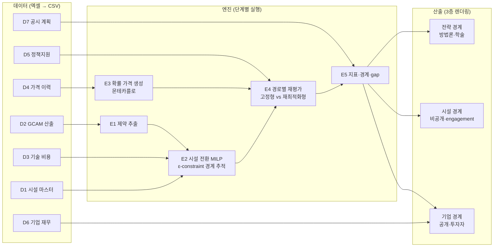

# Capital Allocation Pathway — 재설계 사양서 (v2.0)

**기준 문서:** `Capital_Allocation_Pathway_설계서사.docx` (2026-08)
**상태:** 1단계 — 데이터셋·프로세스·아웃풋 정의. 데이터 수집(엑셀) 완료 전 코드 작성 금지.
**기존 v1 문서(PROJECT_PLAN.md, DATA_CATALOG.md 등)는 참고용이며 본 문서가 우선한다.**

---

## 0. 프로젝트 한 장 요약

**질문:** 기업의 전환비용이 "얼마인가"가 아니라 "무엇에 얼마나 흔들리며, 기업은 그 흔들림을 줄일 수단을 확보했는가."

**3단계 논리:**

1. **제약만 내려받는다** — GCAM 시나리오에서 섹터 탄소예산과 에너지 가격·기술 가용성 경로만 추출한다. 감축량 안분은 하지 않는다. 누가 얼마나 감축하는지는 시설 단위 MILP 최적화가 결정한다. 설비 연한(고로 개수 창 등)이 투자 타이밍을 결정하는 내생 변수다.
2. **불확실성을 원화로 잰다** — 전력·수소·CAPEX 3개 가격의 상관 몬테카를로 경로 수천 개에 각 투자계획을 통과시켜 비용 분포를 얻는다. P50 = 기대비용, P90−P50 = TCaR(전환비용위험). 수소가격은 이력이 없으므로 수소 = f(전력가격, 전해조 CAPEX) 구조식으로 파생시킨다.
3. **기업 내 효율 경계를 그린다** — 한 기업이 선택 가능한 계획 전체를 (기대비용, TCaR) 평면에 놓고 ε-constraint로 효율 경계(frontier)를 추적한다. 공시된 현재 계획과 경계 사이의 거리(frontier gap)가 진단 결과다. 기업 간 순위표는 만들지 않는다.

**최종 지표 5개 (기업당):**

| # | 지표 | 정의 | 답하는 질문 |
|---|---|---|---|
| ① | 정합 CAPEX 소요 | 경로 정합에 필요한 투자액과 시점 | 얼마가, 언제 필요한가 |
| ② | 기대 전환비용 | 비용 분포의 P50 (천원/tCO₂) | 평균적으로 얼마가 드는가 |
| ③ | TCaR와 요인 분해 | P90−P50 + 수소·전력·CAPEX 분산 기여율 | 무엇에 얼마나 흔들리는가 |
| ④ | 정책 불확실성 노출 | 1.5°C와 2.0°C 산출값의 차이 | 정책 강도에 얼마나 걸려 있는가 |
| ⑤ | 유연성 가치 | 계획 고정 비용 − 상황별 재최적화 비용 | 대응 여지가 얼마짜리인가 |

---

## 1. 파이프라인 전체 흐름

실행 순서: `E1 → E2 → E3 → E4 → E5`. E2와 E3은 상호 독립이므로 병렬 가능하나, 단계별 검증을 위해 순차 실행을 기본으로 한다.

---

## 2. 데이터셋 정의 (D1–D7)

원칙 (v1 DATA_CATALOG에서 승계): ① 보고·규제값 우선, 추정값 후순위. ② 원 출처의 경계·기간·단위·통화 보존. ③ 모든 값에 출처 위치와 수집일 기록(`source_register`). ④ 원본 덮어쓰기 금지. ⑤ Scope 1/2 분리 저장.

설계서에는 D1–D6만 명시되어 있으나, **frontier gap 계산에는 기업의 공시 계획 좌표가 필수**이므로 D7을 추가한다 (설계서 §6, §8-4 근거).

통화·단위 기준: **KRW 실질(2025년 기준), 비용 지표는 천원/tCO₂, 에너지는 MWh·GJ·kg H₂**. 환율·물가 변환 계수는 D4에 포함.

### D1. 시설 마스터 (2개 테이블)

**D1a `facility_static.csv`** — 시설(설비 단위) 기본 속성. 행 = 설비 1기.

| 컬럼 | 타입 | 단위 | 설명 |
|---|---|---|---|
| `facility_id` | str | — | 프로젝트 고유 ID (예: `POSCO_POH_BF2`) |
| `company_id` | str | — | 기업 ID |
| `sector` | str | — | `steel` / `petchem` |
| `site` | str | — | 사업장 (포항, 광양, 여수 등) |
| `unit_type` | str | — | BF, BOF, EAF, NCC, 분해로 등 |
| `unit_name` | str | — | 공식 명칭 (고로 2호기 등) |
| `capacity` | float | t/yr | 명목 생산능력 |
| `capacity_unit` | str | — | 조강 t, 에틸렌 t 등 기준 명시 |
| `commissioning_year` | int | 년 | 최초 가동 |
| `last_reline_year` | int | 년 | 최근 개수/대수리 연도 |
| `reinvest_cycle_yr` | int | 년 | 재투자 주기 (고로 통상 15~20) |
| `next_reinvest_year` | int | 년 | **재투자 창 = 전환 의사결정 연도** (E2 핵심 입력) |
| `status` | str | — | 가동/휴지/폐쇄예정 |
| `source_id` | str | — | source_register 참조 |

**D1b `facility_panel.csv`** — 시설×연도 패널. 행 = 시설-연도.

| 컬럼 | 타입 | 단위 | 설명 |
|---|---|---|---|
| `facility_id` | str | — | D1a 참조 |
| `year` | int | 년 | |
| `production` | float | t | 실제 생산량 |
| `emissions_s1` | float | tCO₂ | Scope 1 (규제 검증값 우선: GIR/NGMS, EEGS) |
| `emissions_s2` | float | tCO₂ | Scope 2 |
| `energy_coal` | float | GJ | 원료탄·연료탄 |
| `energy_gas` | float | GJ | LNG 등 |
| `energy_elec` | float | MWh | 전력 |
| `energy_naphtha` | float | t | 석화만 |
| `source_id` | str | — | |

### D2. GCAM 산출 (2개 테이블)

**D2a `scenario_budget.csv`** — 섹터 탄소예산. 행 = 시나리오×섹터×연도.

| 컬럼 | 타입 | 단위 |
|---|---|---|
| `scenario` | str | `NZ15` (1.5°C) / `B20` (2.0°C) |
| `region` | str | Korea / Japan |
| `sector` | str | steel / petchem |
| `year` | int | 5년 간격 (2025–2050) |
| `carbon_budget` | float | MtCO₂/yr (섹터 허용 배출) |
| `gcam_version`, `source_id` | str | 재현성 기록 |

**D2b `scenario_prices.csv`** — 에너지 가격·기술 가용성 경로. 행 = 시나리오×변수×연도.

| 컬럼 | 설명 |
|---|---|
| `scenario`, `region`, `year` | 위와 동일 |
| `variable` | `elec_price`, `h2_price`, `coal_price`, `gas_price`, `co2_price`, `tech_avail_<기술>` |
| `value`, `unit` | 값과 단위 (원/MWh, 원/kgH₂, 가용=0/1 등) |

### D3. 기술 비용 `tech_options.csv`

행 = 전환 기술 옵션 1개. 철강: EAF 전환, 수소환원(HyREX/COURSE50), CCUS, 효율개선, 스크랩 증배. 석화: 전기분해로, 수소 연료전환, CCUS, 바이오·순환원료.

| 컬럼 | 타입 | 단위 | 설명 |
|---|---|---|---|
| `tech_id` | str | — | 예: `steel_h2dri` |
| `sector` | str | — | |
| `applies_to_unit` | str | — | 적용 가능 설비 유형 (BF, NCC 등) |
| `capex_unit` | float | 천원/t능력 | 설비투자 원단위 |
| `opex_fixed` | float | 천원/t능력/yr | 고정 운영비 |
| `opex_var` | float | 천원/t | 변동 운영비 (에너지 제외) |
| `elec_intensity` | float | MWh/t | 전력 원단위 |
| `h2_intensity` | float | kgH₂/t | 수소 원단위 |
| `emission_factor` | float | tCO₂/t | 전환 후 배출 원단위 |
| `avail_year` | int | 년 | 상업 가용 시점 |
| `build_years` | int | 년 | 건설 기간 |
| `lifetime` | int | 년 | 설비 수명 |
| `capex_uncertainty` | float | % | CAPEX 변동 폭 (E3 캘리브레이션 초기값) |
| `source_id` | str | — | |

### D4. 가격 이력 `price_history.csv`

행 = 날짜×시리즈. E3 확률과정(변동성·상관) 캘리브레이션 전용.

| 컬럼 | 설명 |
|---|---|
| `date` | 월 단위 권장 |
| `series_id` | `smp_krw_mwh`(SMP), `indus_tariff`(산업용 전기요금), `kau_krw`(K-ETS), `lng_import`, `coal_import`, `constr_cost_idx`(건설공사비지수), `equip_import_idx`(설비 수입물가), `electrolyzer_capex`(전해조 단가), `usdkrw`, `cpi` |
| `value`, `unit`, `source_id` | |

최소 요건: SMP·KAU·건설공사비지수 **월별 10년 이상**. 전해조 CAPEX는 연도별 글로벌 추정치(IEA/BNEF급) 허용.

### D5. 정책지원 `policy_support.csv`

행 = 지원 시나리오×수단. gross/net-of-support 축 분리용 (확률변수 아님 — 설계서 §3).

| 컬럼 | 설명 |
|---|---|
| `support_scenario` | `none`(gross) / `current` / `enhanced` |
| `instrument` | subsidy_capex, ccfd, tax_credit, ppa_access |
| `tech_id` | 적용 기술 (전체면 `all`) |
| `param_type` | 보조율 %, CCfD strike (원/tCO₂), 적용 상한 등 |
| `value`, `unit`, `valid_from`, `valid_to`, `source_id` | |

### D6. 기업 재무 `company_financials.csv`

행 = 기업×연도. 신용 관점 산출(①의 조달 시점 대비 완충)에만 사용. 최적화에는 미사용.

| 컬럼 | 단위 |
|---|---|
| `company_id`, `year` | |
| `revenue`, `ebitda`, `capex_total`, `total_debt`, `net_debt`, `interest_expense`, `cash` | 십억원 |
| `source_id` | (DART/유가증권보고서) |

### D7. 공시 계획 `disclosed_plan.csv` (신설)

행 = 기업×공시 항목. 현재 계획의 (기대비용, TCaR) 좌표화 입력 → frontier gap 산출. 공시 해상도가 낮으면 `resolution` 필드로 구간 처리 (설계서 §8-4).

| 컬럼 | 설명 |
|---|---|
| `company_id` | |
| `item_type` | `tech_commit`(기술 전환 공시), `timing`(목표 연도), `ppa`(전력계약), `epc`(설비 고정가), `ccfd`, `target`(감축목표) |
| `facility_id` | 특정 시설 지정 시 (없으면 공란) |
| `tech_id` | 해당 기술 |
| `year_stated` | 공시된 실행 연도 |
| `coverage_pct` | 계약 커버리지 (PPA 90% 등) |
| `resolution` | `high`(시설·연도 특정) / `mid`(기술·시기만) / `low`(방향만) |
| `source_id`, `quote` | 공시 원문 인용 |

### 부속: `source_register.csv`

v1 DATA_CATALOG §2 스키마 그대로 승계 (source_id, publisher, title, url_or_doi, retrieved_at, location, licence, sha256, extraction_method, quality_note).

---

## 3. 프로세스(코드) 정의 (E1–E5)

패키지: `src/cap/` (기존 `cap_kj`는 `archive/`로 이동). 단계당 모듈 1개 + CLI 1개. 각 단계는 **CSV 입력 → CSV/Parquet 출력**으로 완결되어 독립 검증 가능.

공통 규칙:
- 실행: `python -m cap e1` … `python -m cap e5`
- 설정: `config.yaml` 1개 (할인율, 시뮬레이션 수, 시나리오 목록, 경로)
- 각 단계는 입력 스키마 검증 실패 시 즉시 중단하고 무엇이 빠졌는지 출력
- 난수는 `seed` 고정 → 전 결과 재현 가능

### E1. 제약 추출 — `e1_constraints.py`

| | |
|---|---|
| 입력 | `D2a`, `D2b` |
| 처리 | GCAM 원자료에서 대상 지역·섹터의 탄소예산과 가격·가용성 경로만 필터·보간(5년→1년). **감축량 안분 절대 금지** |
| 출력 | `out/e1/constraints.csv` (시나리오×연도×제약), `out/e1/price_paths_central.csv` (중심 가격 경로) |
| 검증 | 시나리오별 예산 총량이 GCAM 원값과 일치하는지 잔차 리포트 |

### E2. 시설 전환 MILP — `e2_milp.py`

| | |
|---|---|
| 입력 | `D1a`, `D1b`, `D3`, E1 출력 |
| 처리 | 시설×연도×기술 이진 결정변수. 목적함수 = 총 전환비용(NPV) 최소화. 제약: 섹터 탄소예산, 기술 가용 연도, **재투자 창**(창 밖 전환은 조기폐쇄 비용 부과), 건설 기간, 생산량 유지. ε-constraint: TCaR 상한 격자(예: 10~15개 점)를 걸고 각 점에서 재최적화 → 계획 집합 생성. 계약 변수(PPA 비율, EPC 고정, CCfD 가입)도 결정변수에 포함 |
| 솔버 | HiGHS (오픈소스, `highspy`) — 상용 솔버 불필요 규모 |
| 출력 | `out/e2/plans/plan_<k>.csv` (계획별 시설-연도-기술-계약 스케줄), `out/e2/plan_index.csv` |
| 검증 | 각 계획이 탄소예산을 만족하는지 사후 검산, CAPEX 시점이 재투자 창과 일치하는지 |

### E3. 확률 가격 생성 — `e3_prices.py`

| | |
|---|---|
| 입력 | `D4`, E1 중심 경로 |
| 처리 | 전력·CAPEX: 이력에서 변동성·상관 추정(로그수익률 기반, 평균회귀 여부는 캘리브레이션 단계에서 결정), 중심 경로 주위로 상관 몬테카를로 N개(기본 5,000) 생성. **수소 = f(전력가격, 전해조 CAPEX)** 구조식으로 파생 — 독립 추정 금지 (설계서 §3) |
| 출력 | `out/e3/price_sims.parquet` (sim×year×변수), `out/e3/calibration_report.csv` (추정 파라미터·상관행렬) |
| 검증 | 시뮬레이션 통계량(변동성·상관)이 이력 추정치를 재현하는지 |
| 주의 | 현 구현은 GBM(랜덤워크) — SMP처럼 평균회귀 성향이 있는 시리즈는 장기 분산이 과대될 수 있음. 실데이터 캘리브레이션 단계에서 평균회귀(OU) 여부를 검정 후 결정. 기준연도(2025)는 분산 0에서 시작 |

### E4. 경로별 재평가 — `e4_revalue.py`

| | |
|---|---|
| 입력 | E2 계획 집합, E3 가격 경로, `D5` |
| 처리 | 계획×가격경로×지원시나리오별 총비용 재계산. 두 모드: **고정형**(계획 그대로) vs **재최적화형**(각 경로에서 잔여 결정 재최적화) — 차이가 ⑤ 유연성 가치. gross/net-of-support 병산 |
| 출력 | `out/e4/cost_dist.parquet` (계획×지원×sim 총비용), `out/e4/summary.csv`, `out/e4/flex_value.csv` |
| 검증 | 중심 경로 비용(`central_cost`)을 E2 목적함수와 대조. 단, E2 목적함수는 예산 슬랙 페널티·계약 선형화 항을 포함한 **탐색용 대리 목적함수**이므로 완전 일치하지 않음 — E4가 비용의 최종 기준(authoritative). ⑤ 재최적화는 계획 집합 내 전환(plan-switching) 근사 = 유연성 가치의 하한 |

### E5. 지표·경계·gap — `e5_metrics.py`

| | |
|---|---|
| 입력 | E4 분포, `D7`, `D6` |
| 처리 | 분포→P50, TCaR(P90−P50), 분산 요인분해(수소·전력·CAPEX 개별 고정 재시뮬 방식), ④=1.5°C−2.0°C 차이, ⑤=고정형−재최적화형. (기대비용, TCaR) 평면에서 frontier 구성, D7 좌표화(계획→가장 근접한 모형 계획 매핑, resolution 낮으면 구간) → gap 산출 |
| 출력 | `out/e5/metrics_company.csv` (①–⑤), `out/e5/frontier_points.csv`, `out/e5/gap.csv`, `out/e5/variance_decomp.csv` |
| 검증 | frontier 단조성(비용↑ ⇒ TCaR↓), gap ≥ 0 |

### 렌더링 — `render.py` (E5 이후)

3층 산출: ① 전략 경계(방법론 문서·학술용 그림), ② 시설 경계(**비공개** — engagement·정책 협의용, 저장소에 커밋 금지), ③ 기업 경계(공개 — 투자자용). 그림: 설계서 그림 1~6 유형 (CAPEX 타이밍, 비용 분포, TCaR 분해, frontier+gap, λ 접점, 시나리오 이중 경계).

---

## 4. 아웃풋 정의

### 단계별 중간 산출 (검증 게이트)

| 단계 | 파일 | 확인할 것 |
|---|---|---|
| E1 | `constraints.csv` | 탄소예산 경로가 원자료와 정합 |
| E2 | `plan_index.csv` + 계획별 CSV | 계획 10~15개, CAPEX가 재투자 창에 집중 (그림 1 재현) |
| E3 | `calibration_report.csv` | 변동성·상관이 이력과 부합 |
| E4 | `cost_dist.parquet` | 분포 형태 (그림 2 재현), gross>net |
| E5 | `metrics_company.csv` 외 | 지표 ①–⑤, frontier 형태 (그림 4·5·6 재현) |

### 최종 공개 산출 (기업 단위만 — 시설 단위 비공개 원칙)

1. 기업별 지표표 ①–⑤ (gross/net, 1.5°C/2.0°C 병기)
2. 기업별 frontier 차트 + 공시 계획 좌표 + gap
3. TCaR 요인 분해 차트
4. 방법론 문서 (D7 좌표화 규칙 포함 — 설계서 §8-4 요구)

---

## 5. 실행 로드맵 (사용자 정의 순서)

| 단계 | 작업 | 게이트 |
|---|---|---|
| 1 | 본 문서로 정의 확정 | 사용자 승인 |
| 2 | `data/CAP_data_collection_template.xlsx`에 D1–D7 수집 | **전 시트 채움 + source_register 완비 전 코드 착수 금지** |
| 3 | 엑셀→CSV 변환 (`data/raw/*.csv`) 후 E1부터 단계별 실행·검증 | 각 단계 출력 확인 후 다음 단계 |
| 4 | GitHub 공개 (시설 단위 산출 제외) | 라이선스·재배포 가능 데이터만 |

## 5-1. v2.1 구조 개정 (2026-08-06 1차 실행 진단 반영)

1차 실행에서 효율 경계가 설계서 그림 4처럼 형성되지 않은 원인(완전계약+CCUS 만능해, 기술 점프형 경계,
타이밍 축 붕괴)을 반영한 구조 변경. **2차 데이터 수집 완료 후 적용.**

1. **수소 = 외부 조달 상품.** (구현 완료 2026-08-07) 자가 수전해 구조식 폐기, 가격 = D2b `h2_price` 경로,
   변동성 = 독립 요인(실계열 부재로 사전값 0.25 — CHPS 낙찰가 공개 시 교체). PPA는 수소를 헤지하지 않음.
2. **전력 이원화.** (구현 완료 2026-08-07) 기존 시설 = 계통(`elec_price`), 전환 기술 = 재생 조달
   (`re_price`, 실거래 PPA 앵커 — 한 175·일 198천원/MWh 실질 flat). PPA 변수 = 계약 고정 비율,
   미계약분은 시장(elec 충격) 연동.
3. **CCUS 용량 제약.** 국가·기업 단위 연간 포집·저장 상한(D5 또는 D3 신규 필드) + 수송·저장 변동비
   포함. 상한 없이 CCUS는 만능해가 되어 경계를 붕괴시킴 (1차 실행 실증).
4. **기술 수단 확충.** 섹터당 최소 7~8개 (부분 감축 수단 포함: 수소취입, 스크랩 배합 증대, HBI 장입,
   전기가열 분해로 단계 구분 등) — 경계의 점을 만드는 것은 수단의 개수와 단계성.
5. **분해는 비용 채널 기준** (전력=직접 요금, 수소=조달비 전체, 설비비) — 그림 3 정합. (구현 완료)
6. **조기폐쇄(retire) 옵션.** (구현 완료 2026-08-07) 시설별 폐쇄 결정변수: 배출·에너지 소멸,
   비용 = 잔존 장부가 상각 + **미래 마진 상실**(D1a `margin_kthou_t` — 철강 70·석화 290천원/t,
   D4 마진 시계열 평균). 마진 데이터 없으면 자동 비활성(공짜 감축 방지 가드).
7. **비용 정의 명시.** 평면의 비용축 = 기대 자원지출(P50). 대안 정의(P90 꼬리부담)에서는 저지출·스팟
   계획이 더 비싸질 수 있음 — "기대값에서 싸고 꼬리에서 비싸다"가 도구의 핵심 명제이며, 공시 계획 진단은
   동일 비용 위험축소(= 같은 지출로 지고 있는 불필요한 에너지 위험)를 헤드라인으로 삼는다.

## 6. 확정 사항 (2026-08-06 결정)

1. **대상 범위:** 4사 유지 — POSCO, Nippon Steel (철강), LOTTE Chemical, Mitsui Chemicals (석화). 지역: Korea, Japan.
2. **GCAM 접근:** 직접 구동하지 않고 **공개 시나리오 DB 산출물(추정데이터)** 사용. 1순위 NGFS Phase 5 GCAM 6.0 (Net Zero 2050 → `NZ15`, Below 2°C → `B20`), 섹터 해상도 부족분은 IEA·국가 로드맵으로 보완하고 D2 `source_id`에 출처별 명시.
3. **시뮬레이션 수:** N=5,000 (수렴 검증: N=2,000과 P50·TCaR 차이 1% 미만 확인, 미달 시 10,000으로 증량). seed 고정.
4. **할인율:** 실질 5.0% 기본 (산업 대기업 WACC 근사, KRW 실질 2025 기준) + 민감도 3.5% / 6.5%. config.yaml에 명시.
5. **λ 제시 방식:** 외생 원칙 (설계서 §6). 산출물에는 λ 격자별 접점만 표기.
