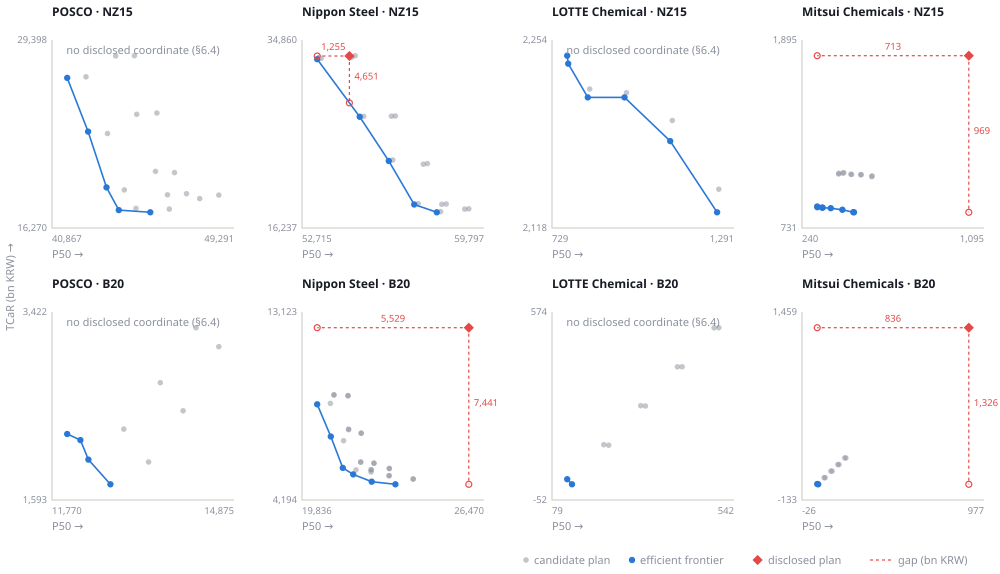

# CAP — Capital Allocation Pathway: Technical Guide

**What this document is.** A technical reader's entry point to the CAP model: what question it
answers, what data it runs on, what it assumes, and what it cannot yet claim. It is written for
someone who intends to interrogate the model, not to be reassured by it.

Every quantitative claim below is either generated from the live repository or carries a pointer to
the file that produces it. Generated passages are delimited by `<!-- GEN:name -->` … `<!-- /GEN:name -->`
in this markdown file — invisible when the markdown is rendered, so the web version
(`web/guide.html`, built by `scripts/build_guide_page.py`) labels each one instead. Where the
evidence is weak, this document says so in the same sentence as the number. A reader with limited
time should read §3 for what the data is, §4.1 for the assumptions that decide the answer, and
**§9 for the objections we think are strongest against our own results**. §10 is a glossary; the
terms that carry the most weight — *technology schedule*, *contract variant*, *candidate plan*,
*TCaR*, *frontier gap* — are narrower here than they sound, and §9's corrections came from reading
them loosely.

**Companion documents.** [`METHODOLOGY.md`](../METHODOLOGY.md) states the model in equations and
holds the assumption ledger (`A-01` … `A-24`). [`REDESIGN_SPEC.md`](../REDESIGN_SPEC.md) is the
design narrative. [`docs/data_gap_registry.md`](data_gap_registry.md) records what we tried to
collect and where we were blocked. `paper/working_paper.md` is the manuscript.

<!-- GEN:stamp -->
> **Repository state.** Code, inputs, config, results and the derived records this document cites (`src`, `data`, `config.yaml`, `out`, `docs/*.csv` — 920 files, results read from disk because `out/` is not tracked) hash to `33d92a014e0b`. Results in this document come from the pipeline run finished `2026-08-10T10:00:24`. Rebuild the generated blocks with `python3 scripts/build_tech_guide.py`; `--check` fails if this document no longer matches that state. The stamp is a content digest, not a commit SHA, because a SHA is not knowable inside the commit that writes it.
<!-- /GEN:stamp -->

---

## 1. The question

Steel and petrochemical firms in Korea and Japan have each published a transition plan. Existing
assessment tools (Climate Action 100+ Net Zero Benchmark, the Nature Communications alignment
literature) answer **"is this plan aligned or not?"** The firm that receives that verdict then asks
a different question — **"how much, when, and what does it cost me if prices move?"** — and no
public tool answers it.

CAP answers it in three parts:

1. **Where is the efficient frontier** between expected transition cost and tail risk, across the
   full set of plans a firm could choose?
2. **How far from that frontier is the plan the firm actually disclosed?**
3. **Is that distance a capital shortfall or a risk-management failure?**

The unit of analysis is the **firm's own opportunity set**, not a ranking against peers. A firm is
compared to the best version of itself.

### Falsifiable claims

The model is built so that each of these can be shown false. Current status is stated plainly.

| ID | Claim | Status |
|---|---|---|
| **P1** | A plan that is cheap in expectation is expensive in the tail — the frontier slopes, it does not collapse to a point. | Holds, but **weakly, and on a different axis than the claim implies**: only 4 of 32 forced technology schedules survive as non-dominated under the headline risk convention, and all 4 sit in one of the 8 bundles — in the other 7 none survives (§6.3) — and in the reported run every non-dominated point in all 8 firm × scenario bundles is a contract variant of one technology schedule (§9.1, O11) — half of those bundles were offered only one schedule to begin with, so the collapse is a finding in the other half. The frontier slopes because contracts trade cost against risk, not because technologies do. |
| **P2** | Contract instruments (renewable PPA, fixed-price EPC, CCfD) raise expected cost and lower tail risk. | Tested for two of the three instruments only. **CCfD is never evaluated**: E5 rebuilds every candidate with `ccfd=0` and D5 holds no CCfD strike, so the instrument is inert in the authoritative revaluation twice over even though E2 signs one in most of its enumerated plans (counts in §9.1). For PPA and EPC the claim is not rejected in steel; **in petrochemicals the hedge a risk-averse criterion actually picks — fixed-price EPC — covers 0% of that firm's tail variance**, because the tail is essentially all hydrogen and the instrument set has no hydrogen hedge (`docs/robustness_structural.md` §3-1). That is a gap in the instrument set, not a counterexample. |
| **P3** | Underspending is itself an energy-price risk position, i.e. the disclosed plan has `gap_risk > 0`. | Holds where a disclosed coordinate can be computed. It cannot be computed for 2 of 4 firms — see §6.4, and note the reason is a model boundary, not corporate disclosure failure. |
| **P4** | The ranking by abatement cost and the ranking by financing burden do not coincide. | Holds. This is why metric ⑥ exists. |

---

## 2. Approach

Five stages. The important structural fact is in stage E2/E4: **the optimiser's objective is a
surrogate used to enumerate candidate plans; it is not the cost we report.**

```
data/raw ──prepare_raw──▶ data/prepared ──▶ E1 ──▶ E2 ──▶ E3 ──▶ E4 ──▶ E5 ──▶ out/
                                        constraints  plans  prices  revalue  metrics
```

| Stage | What it does | Output |
|---|---|---|
| **E1** | Extracts firm-level carbon budgets and central price paths. Budgets take their **shape** from the sector scenario and their **level** from the firm's own realised emissions. | `out/e1/` |
| **E2** | Facility-level MILP. Enumerates candidate transition plans by sweeping an ε-constraint over a linear risk surrogate. Decisions: which facility adopts which technology in which year, closure, PPA share, EPC and CCfD. | `out/e2/plan_index.csv`, `out/e2/plans/` |
| **E3** | Calibrates volatility from price history and simulates stochastic price paths (GBM by default) for electricity, hydrogen and construction cost. | `out/e3/` |
| **E4** | **Authoritative revaluation.** Every candidate plan is re-priced along every simulated path, with contracts applied non-linearly. This is where reported cost and risk come from. | `out/e4/` |
| **E5** | Metrics ①–⑥, the efficient frontier, the disclosed-plan gap, variance decomposition, λ tangency, policy wedge. | `out/e5/` |

### Why the surrogate/authoritative split matters

E2's objective linearises risk and contracts, so it orders plans imperfectly. We measured how
imperfectly, per bundle, over the base plans E2 enumerated:

<!-- GEN:surrogate -->
| Firm | Scenario | Plans | ρ(surrogate cost, P50) | ρ(risk proxy, TCaR) | Surrogate's cheapest = authoritative cheapest |
|---|---|---|---|---|---|
| LOTTE Chemical | B20 | 8 | +0.91 | +0.91 | **no** |
| LOTTE Chemical | NZ15 | 6 | +0.72 | +0.78 | **no** |
| Mitsui Chemicals | B20 | 9 | +0.94 | +0.94 | **no** |
| Mitsui Chemicals | NZ15 | 8 | +0.20 | +0.71 | **no** |
| Nippon Steel | B20 | 5 | +0.21 | +0.29 | **no** |
| Nippon Steel | NZ15 | 5 | -0.56 | +0.55 | **no** |
| POSCO | B20 | 4 | +0.11 | +0.11 | **no** |
| POSCO | NZ15 | 3 | +0.00 | +0.00 | **no** |

The surrogate's cheapest plan is the authoritative cheapest in **0 of 8** (firm × scenario) bundles. Rank correlation runs from -0.56 to +0.94 on cost — it is not a sector split, and the worst cell is a steel one.
<!-- /GEN:surrogate -->

The consequence is a design rule, not a caveat: E2 is allowed to stop at a 2% relative MIP gap and a
60-second time limit, because proving optimality of the *surrogate* to the last basis point buys
nothing. Each plan's `solve_status` is recorded in `plan_index.csv`, so solve quality is auditable
from the outputs rather than asserted here.

### Metrics

| Metric | Definition |
|---|---|
| ① Capital scale and timing | Σ CAPEX; the year of peak CAPEX |
| ② Expected transition cost | P50 of the incremental NPV vs. the incumbent plan, **net of carbon expenditure** (see A-19), and per tonne abated |
| ③ **TCaR** (Transition Cost at Risk) | P90 − P50 of that same distribution |
| ④ Policy exposure | P50 under NZ15 − P50 under B20 |
| ⑤ Flexibility value | Lower bound on the value of re-optimising per path |
| ⑥ Financing burden | Peak CAPEX ÷ 3-year mean EBITDA; total CAPEX ÷ EBITDA; post-hoc net-debt multiple |

**Efficient frontier** = the Pareto non-dominated set in the (P50, TCaR) plane, computed inside one
firm × scenario × support bundle over the candidate set E5 constructs — E2's technology schedules
crossed with a fixed contract grid, not E2's plans as E2 emitted them (§6.3, §10).
**Frontier gap** = horizontal and vertical distance from the disclosed plan's coordinate to that
frontier. `gap_cost` is how much more the firm could have spent at the same risk; `gap_risk` is how
much tail risk it could have removed at the same cost.

Those three objects — the candidate set, the frontier it collapses to, and the disclosed
coordinate's distance from it — are the whole method in one picture:

<!-- GEN:gap_figure -->


Each panel is one firm under one scenario, on its own axes. The dashed legs are the two gap numbers, and where they end is the point of the figure: `_gap` (`src/cap/e5_metrics.py:61`) interpolates along the frontier only while the disclosed point lies within the frontier's span on the axis being measured, and otherwise clamps to the endpoint. Of the 4 distinct gaps in `out/e5/gap.csv`, **4 of 4 cost legs and 3 of 4 risk legs are clamped**: every disclosed plan sits above the frontier's whole tail-risk span — by 1.01× to 477× the tail risk of the riskiest plan on its own frontier — so a cost leg is never an interpolated distance, it is the distance to the frontier's riskiest endpoint. Clamped legs are lower bounds by construction: that endpoint reaches the same cost saving with *less* risk than an interpolated point would have. 8 rows appear in the file because the `support` axis duplicates each one (§3.6, O7).
<!-- /GEN:gap_figure -->

---

## 3. Datasets

Seven input datasets, `D1`–`D7`, mirroring the sheets of the collection workbook. Schemas are
enforced in code at load time (`src/cap/schemas.py`); a missing column or a non-numeric value in a
numeric column stops the run rather than propagating.

<!-- GEN:dataset_inventory -->
| ID | Dataset | Grain | Rows | Years | Domains |
|---|---|---|---|---|---|
| **D1a** | Facility register | one row per production unit | 23 | — | 4 firms, 23 facilities |
| **D1b** | Facility panel | one row per facility-year | 69 | 2022–2024 | 23 facilities |
| **D2a** | Scenario carbon budgets | scenario x region x sector x year | 48 | 2025–2050 | 2 scenarios |
| **D2b** | Scenario price paths | scenario x region x variable x year | 224 | 2025–2050 | 6 variables, 2 scenarios |
| **D3** | Technology options | one row per abatement measure | 13 | — | 13 techs |
| **D4** | Price history | one row per series-date | 99 | — | 18 series |
| **D5** | Policy support | one row per instrument-window | 7 | — | 4 instruments |
| **D6** | Company financials | one row per company-year | 22 | 2020–2025 | 4 firms |
| **D7** | Disclosed plan | one row per commitment | 12 | 2023–2050 | 4 firms, 7 facilities, 4 techs |

9 files across 7 dataset families, 85 schema-required columns in total. Extra columns are permitted and preserved; required ones are not optional.
<!-- /GEN:dataset_inventory -->

The field tables below mark each column **[req]** if `SCHEMAS` in `src/cap/schemas.py` requires
it and **[extra]** if it is an additional column the loader preserves and some stage reads. An
extra column can disappear without the schema check noticing, so the ones that carry model
behaviour are called out where they appear.

### 3.0 Controlled vocabularies

<!-- GEN:vocab -->
| Field | Distinct | Values (count) |
|---|---|---|
| `D1a.sector` | 2 | `steel` (19), `petchem` (4) |
| `D1a.unit_type` | 4 | `BF` (17), `NCC` (4), `FINEX` (1), `EAF` (1) |
| `D1a.capacity_unit` | 4 | `t용선/yr (내용적 추정)` (16), `t에틸렌/yr` (4), `t용선/yr` (2), `t조강/yr` (1) |
| `D1a.status` | 6 | `가동` (18), `휴지예정(전기로 전환)` (1), `가동(여천NCC 통합법인 이관 예정)` (1), `가동중단 계획(롯데대산석화 재편)` (1), `가동(2027.7 지바 집약 거점)` (1), `가동(2030년도 서일본 집약 거점)` (1) |
| `D2a.scenario` | 2 | `NZ15` (24), `B20` (24) |
| `D2a.region` | 2 | `Korea` (24), `Japan` (24) |
| `D2b.variable` | 6 | `re_price` (104), `elec_price` (24), `h2_price` (24), `co2_price` (24), `coal_price` (24), `gas_price` (24) |
| `D2b.unit` | 4 | `KRW/MWh` (128), `KRW/t` (48), `KRW/kg` (24), `KRW/tCO2` (24) |
| `D3.applies_to_unit` | 4 | `NCC` (6), `BF` (5), `NONE` (1), `FINEX` (1) |
| `D3.retrofit` | 2 | `1` (9), `0` (4) |
| `D5.support_scenario` | 1 | `current` (7) |
| `D5.instrument` | 4 | `auction_share_power` (2), `price_cap` (2), `price_floor` (2), `auction_share` (1) |
| `D7.item_type` | 3 | `tech_commit` (7), `target` (3), `timing` (2) |
| `D7.resolution` | 2 | `high` (7), `mid` (5) |

These are the values that **occur**, not the values the schema permits — `load_input` checks that a column exists and is numeric where required, never what it contains. Three of these fields are documentation to every *modelling* stage — no stage branches on `D1a.status`, `D1a.capacity_unit` or `D7.resolution`. `status` carries one exception that sits upstream of this table: `prepare_raw.py` drops a row whose status contains `폐쇄예정` before writing the prepared file, which is why no such value appears above (§3.1). `D5.instrument` is the near-miss: only the one `auction_share` row is read, and by `plancost.auction_share` rather than by the support axis — the other six rows are read by nothing (§3.6). The rest decide behaviour.
<!-- /GEN:vocab -->

### 3.1 D1a — facility register (static)

One row per production unit. This is the model's spine: every technology decision is attached to a
row here.

| Field | Definition | Unit | Notes |
|---|---|---|---|
| `facility_id` **[req]** | Stable key, `COMPANY_SITE_UNIT` (e.g. `NSC_OIT_BF1`) | — | Never reused |
| `company_id` **[req]** | `POSCO`, `NSC`, `LOTTE`, `MCI` | — | |
| `sector` **[req]** | `steel` or `petchem` | — | Determines which technology set applies |
| `site` **[req]** | Works / plant name | — | Site is the grain at which Japanese emissions are disclosed |
| `unit_type` **[req]** | Process type — values in §3.0 | — | Matched against `D3.applies_to_unit`, so it governs technology applicability (A-10) |
| `unit_name` **[req]** | Unit label as published, free text | — | Read by no stage; it is what makes a row checkable against its source |
| `capacity` **[req]** | Nameplate annual capacity | **see `capacity_unit`** | Published capacity where available; otherwise inner volume × 913.3 t/m³·yr (**A-01**) |
| `capacity_unit` **[req]** | The basis `capacity` is stated on | — | **Three bases occur in this one column** — hot metal, crude steel, ethylene (§3.0). See the caution below |
| `commissioning_year` **[req]** | First operation | year | |
| `last_reline_year` **[req]** | Most recent campaign renewal | year | Blast furnaces only |
| `reinvest_cycle_yr` **[req]** | Campaign length | yr | Sets the reinvestment window |
| `next_reinvest_year` **[req]** | Next campaign anchor | year | Early conversion before this anchor writes off residual book value (**A-13**) |
| `status` **[req]** | Operating state, free Korean text as published (§3.0) | — | No *modelling* stage branches on it. One prep-time test does — see the register filter below |
| `source_id` **[req]** | Foreign key into `source_register` | — | Mandatory |
| `incumbent_capex_unit` **[extra]** | Replacement cost of the incumbent asset | thousand KRW/t | Used only for the stranding write-off. Not collected: written at prep from a `unit_type` lookup (`prepare_raw.py:73`) — BF 200, EAF 250, FINEX 300, NCC 150. The BF figure is the one A-13 fails external validation on, at 4.2× |
| `margin_kthou_t` **[extra]** | Operating margin per tonne of output | thousand KRW/t | Closure forfeits it (**A-04**). Also written at prep, from a `sector` lookup (`prepare_raw.py:80`): steel 70, petchem 290. E2 enables the retirement decision **only if every facility of that firm has a positive value** — one blank switches closure off for the whole firm rather than making closure free. All 23 rows are currently populated, so retirement is live for all four firms |

**Unit caution.** `capacity` is not commensurate across rows: a blast furnace is stated in tonnes of
hot metal, an NCC in tonnes of ethylene, and one unit in tonnes of crude steel. Nothing in the model
converts between them — `D3` costs and intensities are applied per tonne of whatever basis the row
carries, so a technology's `capex_unit` is only comparable within a `unit_type`.

**Grain caution.** Emissions are disclosed by *site* in Japan and only by *legal entity* in Korea,
while decisions are made per *unit*. That mismatch is where the model's largest assumption lives —
see A-02 in §4.

**How `capacity` is filled.** Where a published capacity exists it is used unchanged. Where it does
not, it is estimated as inner volume × 913.3 t/m³·yr, where the multiplier is fixed by a
**single calibration point** (Gwangyang BF1, 6,000 m³ = 5.48 Mt/yr; `prepare_raw.py:43-51`).

<!-- GEN:capacity_basis -->
16 of the 23 rows are estimated and all of them are blast furnaces — but that is 16 of the 17 blast furnaces, not all of them. The 1 blast furnace left out (`POSCO_GWY_BF1`) is the one whose capacity is published, and it is also the single point the multiplier was calibrated on. **No estimated row can be checked against a published figure**, because the only blast furnace that carries one was spent fixing the constant. The remaining 6 published rows are not blast furnaces and are stated on other bases (§3.0), so they cannot check it either.
<!-- /GEN:capacity_basis -->

Those rows are marked in `capacity_unit` as
`t용선/yr (내용적 추정)` and carry rank information rather than a defensible absolute (**A-01**).
Two further fields are repaired the same way: a missing `next_reinvest_year` becomes
`commissioning_year + 20`, floored at 2030, and a missing `last_reline_year` becomes
`commissioning_year` (`prepare_raw.py:64-69`). The first of those feeds the stranding write-off
directly, so a repaired reinvestment anchor is a repaired A-13 cost.

#### Which units the model never sees

<!-- GEN:register_filter -->
| Facility | Site | Unit | Raw `status` | Excluded because |
|---|---|---|---|---|
| `POSCO_GWY_BF2` | 광양 | BF | 개수중 | no `capacity`, and `unit_name` carries no `m³` token to estimate one from |
| `POSCO_POH_FINEX2` | 포항 | FINEX | 폐쇄예정(2025말) | `status` contains the literal `폐쇄예정` |
| `NSC_YAW_EAF1` | 八幡 | EAF | 건설중(2029년도 下期) | `commissioning_year` 2029 > 2026 (not yet operating) |
| `NSC_HIR_EAF2` | 広畑 | EAF | 건설중(2029년도 下期) | `commissioning_year` 2029 > 2026 (not yet operating) |
| `LOTTE_ULS_AROM` | 울산 | 방향족 공정(가열로군) | 부분 가동중단(PIA 1·3라인) | no `capacity`, and `unit_name` carries no `m³` token to estimate one from |

28 rows collected, 23 reach the model. The three tests are applied in `scripts/prepare_raw.py:54-62`, before the prepared file is written, so an excluded unit is invisible to every later stage and to the schema check. Two of them are worth stating plainly: the closure test is a **substring match on one Korean string**, so the units whose status says `휴지예정` or `가동중단 계획` stay in the model; and a capacity that has to be estimated is estimated from a `m³` figure parsed out of the unit's *name*, so an operating furnace whose name happens not to carry that token is excluded by a text format, not by a decision.
<!-- /GEN:register_filter -->

None of these exclusions is reversible downstream: the prepared file is the model's universe, and
the schema check in `load_input` validates what survived, not what was collected.

### 3.2 D1b — facility panel (time-varying)

One row per facility-year. Production and energy define the incumbent baseline that every plan is
measured against.

All ten columns are schema-required. The table has nine rows because the composite key
`facility_id` + `year` is shown on one line.

| Field | Definition | Unit | Read by |
|---|---|---|---|
| `facility_id`, `year` | Composite key | — | |
| `production` | Physical output — on the same basis as `D1a.capacity_unit` for that facility | t/yr | E2 (denominator of every intensity, and the quantity every per-tonne cost multiplies) |
| `emissions_s1` | Scope 1 | tCO₂/yr | E2, E1 company base |
| `emissions_s2` | Scope 2 (purchased electricity) | tCO₂/yr | **nothing** — preserved, never joined into the model frame |
| `energy_coal` | Coal / coke input | **GJ/yr** | E2, converted to tonnes at 28.0 GJ/t |
| `energy_gas` | Gas input | **GJ/yr** | E2, converted to tonnes at 54.0 GJ/t |
| `energy_elec` | Electricity input | MWh/yr | E2 |
| `energy_naphtha` | Naphtha feedstock | t/yr | **nothing** — and empty in all 69 rows |
| `source_id` | Foreign key into `source_register` | — | Its value records the derivation: `PREP_ALLOC` (57 rows, top-down from a company disclosure) or `PREP_BOTTOMUP` (12 rows) |

**The two energy columns are stated in GJ, not tonnes.** An earlier version of this table said
t/yr for both, which would make the model's `/ 28.0` and `/ 54.0` conversions wrong by their own
factor. They are gigajoules; the conversion produces the tonnes of fuel that the `coal_price` and
`gas_price` paths are charged against (`src/cap/e2_milp.py:36-37,54-55`).

#### Derivation

`_prep_company` (`src/cap/e2_milp.py:49-55`) reduces the panel to one row per facility and forms
every incumbent coefficient from it:

```
recent = panel[year >= max(year) - 2].groupby(facility_id).mean()   # → Q_f, and the 3-yr means
ef_inc       = emissions_s1 / production            # tCO₂ per t of output
elec_int_inc = energy_elec  / production            # MWh/t
coal_int_inc = energy_coal  / production / 28.0     # GJ/t → t coal per t of output
gas_int_inc  = energy_gas   / production / 54.0     # GJ/t → t gas  per t of output
```

The panel holds exactly 2022–2024 and every facility has all three rows, so the "3-year mean" is
the whole panel rather than a trailing window — a fourth year would move the baseline of every
result. `mean()` skips nulls silently, so a facility with a gap would be averaged over the years it
has, with no warning; that case does not currently arise.

<!-- GEN:d1b_intensity -->
| Unit type | Facilities | Q (Mt/yr) | `ef_inc` tCO₂/t | coal GJ/t | gas GJ/t | elec MWh/t |
|---|---|---|---|---|---|---|
| `BF` | 17 | 65.31 | 1.72–2.34 | 13.5 | 0.4 | 0.08 |
| `EAF` | 1 | 2.33 | 0.44 | 0.0 | 1.0 | 0.55 |
| `FINEX` | 1 | 1.86 | 2.01 | 13.0 | 0.4 | 0.10 |
| `NCC` | 4 | 3.00 | 0.95 | 0.0 | 8.0 | 0.35 |

Columns 4–7 are the coefficients `_prep_company` builds (`src/cap/e2_milp.py:49-55`) over the 23 facilities carrying 72.5 Mt/yr of incumbent output. A single value in a range column means every facility of that unit type carries the identical number: the three energy columns are **not observations**. They were absent from the collected panel and are written as `production × ROUTE[unit_type]` in `scripts/prepare_raw.py:100-107,190,211`, so `energy_x / production` returns the route constant by construction and no facility-level energy information exists in the model. `ef_inc` is the one incumbent coefficient that varies within a unit type, and only for steel — petrochemical Scope 1 is itself `production × ROUTE[NCC][0]`, which is why the injected 0.95 tCO₂/t *is* the petrochemical level rather than an input to it (**A-03**).
<!-- /GEN:d1b_intensity -->

#### Missing and zero handling

There is no imputation inside the model — gaps are either repaired at prep (§3.1) or they stop the
run. The rules, in the order they bite:

- **NaN in a model coefficient stops the solve.** `production`, `ef_inc`, the three energy
  intensities, `capacity`, `next_reinvest_year` and `reinvest_cycle_yr` are checked per company and
  a null in any of them raises before the LP is built (`e2_milp.py:111-118`), because CBC's
  behaviour on a NaN coefficient is undefined rather than merely wrong.
- **Zero production is not checked.** Every intensity divides by `production`, so a zero would
  produce `inf` rather than NaN and pass the guard above. No row is currently zero, and this is a
  gap in the check, not a property of the data.
- **A blank `margin_kthou_t` disables retirement for the whole firm**, rather than making
  retirement free — see §3.1.
- **Columns nothing reads are not filled.** `energy_naphtha` is blank in all 69 rows and
  `emissions_s2` is never joined into the model frame, so neither can fail loudly; both are
  recorded here instead.

**Known hole:** the absent `energy_naphtha` means petrochemical feedstock exposure is understated.
Because margin is taken on an operating-profit basis there is no double-count, but the naphtha
price channel is absent.

**Emission boundary:** Scope 1 only (**A-21**). `emissions_s2` is non-zero in 63 of 69 rows and is
preserved but never charged, because budgets are anchored to the firm's own base and the choice is
level-neutral.

### 3.3 D2a / D2b — scenarios

`D2a` carries sector carbon budgets, `D2b` carries price paths. Both are stated on 5-year anchors
(2025, 2030 … 2050) that E1 interpolates annually — **with one exception**: `re_price` is already
annual, and flat. It is a single procurement price held constant to 2050 (Korea 175,000, Japan
198,000 KRW/MWh), so the renewable-PPA channel has a level but no path, while every other price
does.

| Field | Definition |
|---|---|
| `scenario` | `NZ15` (1.5 °C-consistent) or `B20` (below 2 °C) |
| `region` | `Korea` or `Japan` — Korean budgets are direct-emission based and on calendar years, Japanese include purchased power and are on fiscal years |
| `year` | Anchor year. Both files are on 5-year anchors that E1 interpolates annually, with `re_price` the exception noted above — so a row is a knot on a path, not an observation of that year |
| `sector` (D2a) | `steel` / `petchem` |
| `carbon_budget` (D2a) | Sector emissions allowance for that year |
| `gcam_version` (D2a) | Provenance tag of the pathway — see the caveat below |
| `variable` (D2b) | `elec_price`, `re_price`, `h2_price`, `coal_price`, `gas_price`, `co2_price` |
| `value`, `unit` (D2b) | The price and its unit (`KRW/MWh`, `KRW/kg`, `KRW/t`, `KRW/tCO₂`) |
| `source_id` | One or more keys into `source_register`, optionally followed by a free-text derivation note in parentheses. A cell is not a bare key: `KR_PPA_2026/REI_JP_PPA_2025` names two, and the qualifier is where the transformation is recorded. Resolution splits on `; \| + /` and drops the parenthetical (`scripts/audit_data.py:source_parts`) |

Only the **ratio** to the base year is used (**A-06**), so the Korea/Japan boundary difference
survives only in path shape, not level. Electricity is deliberately split in two: incumbent
consumption is priced at grid tariff, transition technologies at a renewable PPA price (`re_price`).

**Provenance caveat — these are not GCAM output.** They are provisional in-house pathways built to
exercise the structure until the GCAM-KAIST solved output arrives; the `gcam_version` column says so
in the data (`EST_v0 (비GCAM 잠정)`). The construction is documented anchor by anchor in
[`data/manifests/estimation_notes_D2_v0.md`](../data/manifests/estimation_notes_D2_v0.md). Every
`source_id` resolves — the audit reports no dangling key in either file — but resolving is not the
same as being anchored, and the split is uneven enough to be worth stating row by row.

<!-- GEN:d2_provenance -->
| Series | Region | Rows | Anchored | Anchor source |
|---|---|---|---|---|
| **D2a** budgets | `Japan` | 24 | 0 | **none** |
| **D2a** budgets | `Korea` | 24 | 2 | KR_NETZERO_2050 |
| D2b `co2_price` | `Japan` | 12 | 6 | IEA_GECM_CO2PRICE, IEA_GECM_DOC_2025 |
| D2b `coal_price` | `Japan` | 12 | 4 | IEA_GECM_DOC_2025 |
| D2b `elec_price` | `Japan` | 12 | 0 | **none** |
| D2b `gas_price` | `Japan` | 12 | 5 | IEA_GECM_DOC_2025 |
| D2b `h2_price` | `Japan` | 12 | 2 | JP_H2_STRATEGY_2023 |
| D2b `re_price` | `Japan` | 52 | 52 | KR_PPA_2026/REI_JP_PPA_2025 |
| D2b `co2_price` | `Korea` | 12 | 10 | IEA_GECM_DOC_2025, KETS_P4_CONFIRM_2025 |
| D2b `coal_price` | `Korea` | 12 | 4 | IEA_GECM_DOC_2025 |
| D2b `elec_price` | `Korea` | 12 | 0 | **none** |
| D2b `gas_price` | `Korea` | 12 | 5 | IEA_GECM_DOC_2025 |
| D2b `h2_price` | `Korea` | 12 | 2 | MOTIE_H2_PLAN_2021 |
| D2b `re_price` | `Korea` | 52 | 52 | KR_PPA_2026/REI_JP_PPA_2025 |

46 of 48 budget rows and 82 of 224 price rows are our own construction (`EST_D2A_V0` / `EST_D2B_V0`); the rest carry a register key. Rows with a key are the anchors the line is drawn between, so a variable showing **none** was drawn without one.

Identical under both scenarios in every year: Japan `elec_price`, Japan `re_price`, Korea `re_price`. `re_price` is flat by construction (**A-05**), but a differentiated variable that does not differentiate is an input the scenario cannot reach — electrification economics in that region see the same power price at 1.5 °C and at 2 °C.
<!-- /GEN:d2_provenance -->

Read the **Anchored** column as the count of rows that pin the line; everything else is the line
drawn between them, labelled `EST_D2A_V0` / `EST_D2B_V0` and due to be replaced wholesale on
receipt of the solved output. Four things in that table should be said in words:

- **Japanese budgets have no anchor row at all.** The Korean budget path is pinned by two
  `KR_NETZERO_2050` rows; the Japanese one is entirely ours.
- **`elec_price` carries no register key in either region.** The construction note is explicit
  about what stands behind it, and it is not a market: Japan is a simple average of METI new-build
  LCOEs and is **scenario-undifferentiated**, Korea is a three-year average generation cost (110.2
  KRW/kWh) extrapolated to an SNU 2050 scenario **in which the nuclear share is used as the proxy
  for scenario stringency**. The gap between the Korean NZ15 and B20 power paths is therefore a
  nuclear-share assumption, not an abatement cost.
- **`coal_price` is thermal coal**, not the coking coal a blast furnace consumes. A coking-coal
  scenario path has not been obtained (§6.5).
- **Korean `h2_price` for 2025 is blank** — the only two missing values in D2b — because no
  verified current price was found, so the Korean hydrogen path starts from the 2030 target anchor
  (3,500 KRW/kg NZ15). Japan's 2025 value is present and is 10,240 KRW/kg, so the two regions'
  hydrogen paths are not comparable at the near end.

One further caveat: the central paths do not state whether they are means or medians, which is the
whole reason A-24 exists (§4). Series definitions are also mixed across scenarios — Korean NZ15
carbon price is a central-bank shadow price, Japanese NZ15 is IEA NZE, B20 is IEA STEPS.

### 3.4 D3 — technology options

One row per abatement measure available to a sector.

<!-- GEN:d3_excluded -->
**The model sees 13 of the 17 rows in `data/raw/tech_options.csv`.** 4 are filtered out in preparation and nothing downstream can adopt them. 2 of them are the CCUS measures (`petchem_ccus`, `steel_ccus`): **CCUS is not in the option set at all** — a user scope decision of 2026-08-06, taken until storage-capacity and cost data exist, applied at `scripts/prepare_raw.py:303`. The other 2 are alternative-source CAPEX estimates kept for sensitivity and read by nothing in this run (`steel_eaf_alt` 700 against the adopted 240; `steel_h2dri_alt` 1,126 against the adopted 863 thousand KRW/t of capacity). This is the one exclusion in §3 that removes a measure firms actually name in their own disclosures — see §6.4 for what it costs the disclosed-plan comparison.
<!-- /GEN:d3_excluded -->

**Adoption is all-or-nothing per facility.** There is no coverage fraction: E2's decision variable
is binary over (facility, technology, adoption year), and at most one technology or one closure may
be taken per facility over the whole horizon. Partial abatement is therefore expressed in two other
places — in `emission_factor`, which is the post-measure intensity rather than a reduction rate, and
in `retrofit`, which decides whether the measure's energy intensities are **added to** the
incumbent process or **replace** it.

| Field | Definition | Unit |
|---|---|---|
| `tech_id` **[req]** | e.g. `steel_h2dri`, `petchem_ecracker` | — |
| `sector` **[req]** | `steel` (7 rows) or `petchem` (6) — the measure is only offered to firms in that sector | — |
| `applies_to_unit` **[req]** | Which single `unit_type` it can be applied to, matched **as an exact string** against `D1a.unit_type` (`src/cap/e2_milp.py:148`); `NONE` marks a greenfield measure applicable to no existing unit (`steel_eaf`) | — |
| `capex_unit` **[req]** | Unit capital cost | thousand KRW / t capacity |
| `opex_fixed` / `opex_var` **[req]** | Fixed / variable operating cost — fixed is charged on `capacity`, variable on `production` | thousand KRW per t capacity·yr / per t |
| `elec_intensity` **[req]** | Electricity requirement, priced at `re_price` | MWh/t |
| `h2_intensity` **[req]** | Hydrogen requirement | kg/t |
| `emission_factor` **[req]** | Post-conversion intensity, **not** a reduction rate | tCO₂/t |
| `avail_year` **[req]** | Earliest adoption year | year |
| `build_years` **[req]** | Construction duration — CAPEX is spread evenly across it (**A-18**) | yr |
| `lifetime` **[req]** | Economic life | yr |
| `capex_uncertainty` **[req]** | Relative CAPEX dispersion, used as a **relative** multiplier only (**A-22**) | **percent, 30–60 across our set** — not a fraction |
| `source_id` **[req]** | Foreign key into `source_register` | — |
| `retrofit` **[extra]** | 1 = keeps the incumbent process running and adds the measure's intensities on top; 0 = swaps the process energy out. 9 of 13 rows are retrofits | 0/1 |

#### Which measures a facility can actually take

The `applies_to_unit` match is exact and one-sided, so the option set a facility sees is the
intersection of two data columns rather than a modelling choice — and the intersection is empty at
both ends of the table below.

<!-- GEN:d3_reach -->
| Unit type | Facilities | Capacity (Mt/yr) | Measures | Which |
|---|---|---|---|---|
| `BF` | 17 | 77.5 | 5 | `steel_eff`, `steel_h2dri`, `steel_h2inj`, `steel_hbi`, `steel_scrap` |
| `EAF` | 1 | 2.5 | 0 | **none** |
| `FINEX` | 1 | 2.0 | 1 | `steel_hyrex` |
| `NCC` | 4 | 3.3 | 6 | `petchem_bio`, `petchem_ecracker`, `petchem_ecracker_hybrid`, `petchem_eff`, `petchem_h2fuel`, `petchem_hp_whr` |
| `NONE` | 0 | 0.0 | 1 | `steel_eaf` |

The two ends of this table are the ones to read. Measures targeting a unit type no facility has, and so never adoptable: 1 of 13 (`steel_eaf`). Facilities offered no measure at all, able only to run on or retire: 1 of 23 (`POSCO_GWY_EAF1`). Both follow from the same exact-string match and neither is an error the schema or the audit can see — every row is present, typed and sourced.
<!-- /GEN:d3_reach -->

The `steel_eaf` row is the consequential one, because the disclosed-plan file is not silent about
it: D7 carries **three `high`-resolution EAF commitments** (POSCO Gwangyang, Nippon Steel Yawata
and Hirohata). None of them can be enforced. Gwangyang's is dropped with a stated reason —
`e2_milp.py:332` classifies it as a model-boundary exclusion, not a disclosure-quality one — and
the two Nippon Steel units are dropped one line earlier, at `e2_milp.py:325`, because those
facility IDs are not in the register at all; that path prints nothing and adds nothing to the
dropped list. **The only disclosed commitment in D7 that states an investment figure — ¥630.2bn
plus ¥140bn for 2.5 Mt/yr of EAF conversion at the two Nippon Steel sites — is therefore invisible
to the frontier-gap comparison in §6.4**, and invisible without leaving a trace. It is
recorded as gap F4 in [`docs/data_gap_registry.md`](data_gap_registry.md); the fix is a register
addition, not a model change.

#### Evidence bands

`D3b_tech_bands.csv` carries `[value_low, value_high]` evidence bands from the literature. The
guide previously described these as bands "per (tech, field)", which overstates what is there:

<!-- GEN:d3b_bands -->
| Tech | Field | Central | Band | Position | Tier |
|---|---|---|---|---|---|
| `steel_h2dri` | `capex_unit` | 863 | 863 – 1095 | at lower bound | T3 |
| `steel_eaf` | `capex_unit` | 240 | 370 – 835 | **below band** | T3 |
| `steel_eaf` | `emission_factor` | 0.05 | 0.04 – 0.05 | at upper bound | T3 |

**3 bands over 2 of 13 technologies and 2 of 11 numeric fields** — this is a spot check on two steel CAPEX values, not a band layer over the option set. Every other central value in D3 is a point with a source and no stated range, which is why CAPEX dispersion enters the model through `capex_uncertainty` (**A-22**) instead. No central value sits strictly inside its band: two sit on a bound and 1 sits outside (`steel_eaf.capex_unit`). That is deliberate and tested — `steel_eaf` at 240 is POSCO's Gwangyang project on a reused site, and the band it sits below is stated to be greenfield EAF builds in the `derivation` column of `data/raw/tech_bands.csv` — that is where the greenfield attribution lives, not in the estimation notes this sentence used to cite. It is the evidence that the central values were not quietly snapped to the literature. The independent implementation puts a sharper reading on the same number: of the 6 primary EAF project figures in `cap-efficient/data/technology_cost_evidence.csv`, Gwangyang's 240 is the lowest and the only one flagged partial-scope (1 of 6), while the other 5 normalise to 1,314–2,899 thousand KRW/t because they are gross figures covering government support and downstream measures. Read 240 as a defensible floor rather than a central EAF cost. It costs this model nothing either way, because `steel_eaf` is the row no facility can adopt (above) — it costs the other model, which does allow the conversion, and that is recorded in [`docs/tech_cost_reconciliation.md`](tech_cost_reconciliation.md).
<!-- /GEN:d3b_bands -->

**Hydrogen is an externally procured commodity**, not an electrolyser built inside the model
(**A-05**). The earlier structural formulation was discarded. The `steel_h2dri` CAPEX band is
stated on the same ex-electrolyser boundary, which is why its lower bound and our central value
coincide rather than merely agreeing.

### 3.5 D4 — price history

Five columns, all required: `date`, `series_id`, `value`, `unit`, `source_id` — one observation per
row. Used for one purpose: estimating annualised volatility per stochastic factor. This is the
thinnest dataset in the project and it directly sets the level of metric ③. Note that `unit` is
free text carrying the definitional caveat for the series (basis, coverage, whether a value is
estimated), so it is worth reading in the table below rather than skipping as a label.

| Field | Definition | Unit |
|---|---|---|
| `date` **[req]** | Observation date, `YYYY-MM-DD`. Spacing is irregular — annual for most series, and the interval is never checked | date |
| `series_id` **[req]** | Series key. A series is only opened if some factor names it in `FACTOR_SERIES` (`src/cap/calibration.py:24-26`); 11 of the 18 series present are named by no factor | — |
| `value` **[req]** | The quoted level. Volatility is estimated from log differences of consecutive values, so only the shape matters, not the level — except for the electrolyzer series, whose last value anchors the hydrogen price path | see `unit` |
| `unit` **[req]** | Free text carrying the series' basis and caveats, not a parseable unit code. **No stage converts on it**, so two series in different units may not be mixed inside one factor | — |
| `source_id` **[req]** | Foreign key into `source_register` | — |

The three factors are electricity, hydrogen and capex, and the mapping from factor to series is a
constant in `calibration.py`, not a property of the file: **a series no factor names is never
opened, however long it is.** The "Read as" column below is that mapping.

<!-- GEN:price_series -->
| Series | Obs | From | To | Read as | Unit |
|---|---|---|---|---|---|
| `smp_monthly` | 19 | 2025-01 | 2026-07 | `elec` | 원/kWh (육지 월별) |
| `usdkrw` | 11 | 2015-01 | 2025-01 | — | 원/USD (연평균) |
| `smp_krw_mwh` | 11 | 2015-01 | 2025-01 | — | 원/kWh (육지, 연평균) |
| `indus_tariff` | 10 | 2015-01 | 2024-01 | `elec` | 원/kWh (산업용 전체 평균판매단가, 연평균) |
| `kau_krw` | 9 | 2015-01 | 2023-01 | — | 원/tCO2 (연평균) |
| `ethylene_naphtha_spread` | 7 | 2019-12 | 2025-12 | — | USD/t (CFR NEA - C+F Japan; 19-21 추정) |
| `jepx_spot` | 7 | 2019-03 | 2025-03 | `elec` | JPY/kWh (FY 시스템프라이스) |
| `steel_margin_krw_t` | 7 | 2019-12 | 2025-12 | — | 원/t (포스코 별도 영업이익/조강톤, 추정 혼재) |
| `cpi` | 4 | 2020-01 | 2024-01 | — | 지수(2020=100, 연평균) |
| `constr_cost_idx` | 3 | 2020-01 | 2025-01 | `capex` | 지수(2020=100, 11월값) |
| `lng_import` | 2 | 2022-01 | 2023-01 | — | USD/t (국가평균 도입단가, 연평균) |
| `electrolyzer_capex` | 2 | 2022-01 | 2023-01 | `ez` | KRW/kW |
| `coal_import` | 2 | 2022-01 | 2023-01 | — | USD/t (유연탄 전체 — 원료탄 아님) |
| `h2_contract_krw_kg` | 1 | 2024-12 | 2024-12 | `h2` | KRW/kg (한국 청정수소 현 공급비 ~1만원) |
| `h2_target_krw_kg` | 1 | 2030-12 | 2030-12 | — | KRW/kg (수소 로드맵 목표) |
| `re_ppa_jp_krw_mwh` | 1 | 2024-12 | 2024-12 | — | KRW/MWh (일본 물리 PPA HV 총비용 21.5JPY×9.2) |
| `re_ppa_krw_mwh` | 1 | 2026-01 | 2026-01 | — | KRW/MWh (한국 태양광 PPA 170원대 중반) |
| `re_ppa_wind_krw_mwh` | 1 | 2026-01 | 2026-01 | — | KRW/MWh (한국 육상풍력 PPA 180원 중반) |

**18 series, 99 observations. 12 of them are read by nothing** — they are level references and provenance for the price paths in D2b, not inputs to the volatility calibration. Of the 7 series the calibration names, 3 clear the 6-observation floor (`smp_monthly`, `indus_tariff`, `jepx_spot`), and `equip_import_idx` is named but absent from D4. So 2 of the 3 factors take a prior instead of an estimate: `h2` (0.25), `capex` (0.06). The factor correlation matrix is the identity for the same reason — with two factors producing no return series there is nothing to correlate, so identity is the absence of an estimate, not a finding of independence. The electrolyzer capex path is anchored on the last of 2 observations (2,916,000 KRW/kW @2023) with its decline rate and volatility taken from priors (5%/yr, 0.10); note the two observations *rise* 32% while the imposed path falls.
<!-- /GEN:price_series -->

The 6-observation floor (5 log returns) is applied **per series, not per factor**: a factor
estimates from whichever of its series clears the floor, and falls back to a prior only when none
of them does. Electricity clears it three times over and its estimate is the mean of the three
series' annualised volatilities; hydrogen and capex clear it zero times and take priors of 0.25 and
0.06. The run **warns on every fallback** (**A-17**), which is the only reason a prior cannot be
mistaken for an estimate downstream.

Two consequences are worth stating plainly, because metric ③ is where they land. First, **two of
the three risk factors carry no market evidence at all** — their level of volatility is a
judgement, and the ±30% parameter sweep in `docs/uncertainty_propagation.md` is the honest way to
read them. Second, the electrolyzer capex path — which sets the hydrogen price through the
structural relation in §2, and so is not a small input — is anchored on a **two-point** series
whose own direction contradicts the prior decline imposed on top of it.

### 3.6 D5 — policy support

Instruments that change the economics: auction share, price collar, capital subsidy, CCfD. Seven
rows.

| Field | Definition |
|---|---|
| `support_scenario` | Which support world the row belongs to. **Every row in the file is `current`** — `none` is the absence of rows, not a value: `support_params` returns an empty object without reading the file |
| `instrument` | Instrument key — values in §3.0. `subsidy_capex` and `ccfd` are the two the code reads and neither occurs |
| `tech_id` | Which technology the instrument attaches to; `all` for economy-wide instruments |
| `param_type`, `value`, `unit` | The parameter and its value; `param_type` is a Korean label and is not parsed |
| `valid_from`, `valid_to` | Applicability window; a blank end extends to the horizon |
| `source_id` | Foreign key into `source_register` |

**The `support` axis is currently empty of information, and the manuscript says so.** The only
instruments `plancost.support_params` reads are `subsidy_capex` and `ccfd`, and D5 contains no rows
of either type — the seven rows present are K-ETS auction shares and a Japanese price collar. So
`current` returns the same object as `none`, and the results table has a column where there is no
signal. A test asserts this correspondence, so the day a subsidy row arrives the test fails and the
prose must be corrected with it.

**One D5 row does reach the model, and not through that axis.** `plancost.auction_share` reads the
single `auction_share` row — K-ETS Phase 4 non-power free allocation, 15% auctioned, 2026–2030 —
and overwrites the estimated ramp in `config.yaml` for exactly those years, which raises the
auctioned share in 2026–2029 from the interpolated 0.11–0.14 to a flat 0.15. Confirmed allocation
beats an estimate wherever confirmed allocation exists, so this happens on every path, under both
support scenarios, in E2 and E5 alike. It is worth being precise about the difference: the axis
carries no signal, but the file is not inert. The other six rows are: two power-sector auction
shares, deliberately not applied — `auction_share_power` is a separate key precisely so the 50%
power figure cannot leak into steel and petrochemicals, and a test asserts it does not — and four
GX-ETS price collar rows that no stage reads.

### 3.7 D6 — company financials

One row per company-year. Feeds metric ⑥ only.

| Field | Definition | Unit |
|---|---|---|
| `company_id`, `year` | Composite key | — |
| `revenue` **[req]** | Revenue as reported by the entity named in `source_id` | **bn KRW or 億円 — see the currency caution** |
| `ebitda` **[req]** | Earnings before interest, tax, depreciation and amortisation **as the filer labels it**; for the two Japanese firms the value is reported operating profit, which is not the same quantity | same as `revenue` |
| `capex_total` **[req]** | Reported capital expenditure, all purposes — **not** the model's transition CAPEX, which carries the same name in the result files | same as `revenue` |
| `total_debt` **[req]** | Gross interest-bearing debt | same as `revenue` |
| `net_debt` **[req]** | Debt net of cash | same as `revenue` |
| `interest_expense` **[req]** | Interest cost for the year | same as `revenue` |
| `cash` **[req]** | Cash and equivalents | same as `revenue` |
| `source_id` **[req]** | Foreign key into `source_register`. It also fixes the **legal entity**: the POSCO rows are the steel operating company, not the holding company | — |

**Currency caution.** No exchange rate is applied anywhere in the pipeline. The Korean rows are
billion KRW and the Japanese rows are 億円, so any cross-country reading of ⑥ carries that error —
see §8 claim 8. Ratios within one firm are unaffected, because numerator and denominator share the
row's currency.

Coverage is 2020–2025 for POSCO and Nippon Steel, 2021–2025 for LOTTE, 2020–2024 for Mitsui. The
column list is not a description of a filled table — most of these columns are sparse, and the
sparsity is not evenly spread across the four firms:

<!-- GEN:d6_coverage -->
| Column | Non-null | Firms | Read by |
|---|---|---|---|
| `revenue` | 21 / 22 | all four | ⑥ `capex_total_to_revenue_pct` (latest year) |
| `ebitda` | 22 / 22 | all four | ⑥ reference earnings (mean of last 3 reported) |
| `capex_total` | 11 / 22 | MCI, NSC | — |
| `total_debt` | 9 / 22 | MCI, NSC | — |
| `net_debt` | 9 / 22 | MCI, NSC | ⑥ `netdebt_to_ebitda_now/post` (latest year) |
| `interest_expense` | 2 / 22 | MCI | — |
| `cash` | 10 / 22 | MCI, NSC | — |

22 company-years. **4 of the 7 financial columns are read by no stage** (`capex_total`, `total_debt`, `interest_expense`, `cash`) — they were collected, they pass the schema check, and metric ⑥ never opens them. Of the three that are read, `net_debt` exists only for the two Japanese firms, so the net-debt multiple — the leverage half of ⑥ — is blank for POSCO and LOTTE by entity boundary, not by oversight. Reference earnings are the last three *reported* years, which differ by firm: LOTTE Chemical 2023–2024–2025; Mitsui Chemicals 2022–2023–2024; Nippon Steel 2023–2024–2025; POSCO 2023–2024–2025.
<!-- /GEN:d6_coverage -->

Reference earnings for ⑥ is the **3-year mean EBITDA** (**A-20**) — petrochemicals are at a cyclical
trough and a single-year denominator flips the conclusion. It is the last three years *reported*,
not a fixed window, so the three firms whose 2025 is filed are compared on 2023–2025 while Mitsui
is compared on 2022–2024. Firms with non-positive reference earnings get **no ratio and a stated
verdict** rather than a misleading number — which is LOTTE, whose EBITDA is negative in four of its
five years. The post-hoc net-debt multiple is an **upper bound under full debt financing**, not a
forecast of financing mix, and it exists for two of the four firms.

Three definitional caveats sit inside this table, and all three are live:

- **The column called `ebitda` is not EBITDA for every firm.** For Nippon Steel it is 営業利益
  (operating profit) and for Mitsui コア営業利益 (core operating profit) — depreciation is not added
  back. Metric ⑥ therefore understates Japanese capacity to fund relative to Korean.
- **Reporting boundaries differ.** POSCO is 별도 (parent-only), LOTTE consolidated, and the two
  Japanese firms consolidated on an April–March fiscal year. Nippon Steel's FY2025 additionally
  consolidates U.S. Steel, which breaks the series rather than continuing it.
- **The currency unit is mixed and nothing converts it.** Korean rows are in billion KRW and
  Japanese rows in 億円 as published, and no stage applies an exchange rate — `e5_metrics` reads the
  column straight into `ebitda_ref_bnkrw`. At the project's own rate (9.2 KRW/JPY) 1 億円 is 0.92
  billion KRW, so Japanese denominators in ⑥ are overstated by about 8% and the ratios understated
  by the same. It is a small error and a real one; it is registered in
  [`docs/data_gap_registry.md`](data_gap_registry.md) rather than silently carried.
- **The empty leverage cells are a boundary decision, not a hole.** POSCO's rows are the steel
  operating company; the balance sheet that is readily available is the holding company's. Pairing
  group debt with operating-company EBITDA produces a ratio that means nothing, so the field stays
  empty and the leverage half of ⑥ is reported for the Japanese firms only.

### 3.8 D7 — disclosed plan

The firm's own published commitments, decomposed so they can be forced into the MILP.

| Field | Definition |
|---|---|
| `company_id` | Who committed |
| `item_type` | `target` (3 rows), `tech_commit` (7), `timing` (2) |
| `facility_id`, `tech_id`, `year_stated` | What was committed, where, when. `facility_id` and `tech_id` are blank where the disclosure names neither |
| `coverage_pct` | Share of the unit covered. **Blank in all 12 rows** — no firm quantifies it, so no partial commitment can be forced. It is also the field a `ppa` row would carry, which is why the PPA share below is always 0 |
| `resolution` | How enforceable the statement is, as judged when the row was written. Two values occur, `high` (7) and `mid` (5). **Read by no stage, and it decides nothing** — the enforcement test below never consults it, so a `high` row and a `mid` row fail or survive on identical grounds |
| `quote` | The disclosure text the row was derived from, verbatim |
| `source_id` | Foreign key into `source_register` |

What actually becomes a fixed decision is narrower than the table suggests. `_disclosed_fixed`
applies five tests in this order, and **the order is what decides whether a rejection leaves a
trace**:

1. `item_type == tech_commit` — `target` and `timing` rows are context, not constraints.
2. `facility_id` is a unit of that firm in D1a, and `year_stated` is present. **Failing here is
   silent**: no warning, no row in the skip file. A blank `facility_id` and a `facility_id` D1a has
   never heard of are rejected identically and invisibly.
3. `tech_id` exists in D3 — recorded, with a reason.
4. The technology's `applies_to_unit` equals that unit's `unit_type`, exact string match (§3.4) —
   recorded, with a reason.
5. The technology is available before the horizon ends. **Silent again.** The availability year the
   test uses is `max(D3.avail_year, scenario availability)` (constraint C4), which reads as though a
   verdict could flip between scenarios — **it cannot, on this data.** The scenario term comes from
   `out/e1/tech_availability.csv`, and that file is a header and nothing else: D2b carries six
   variables (`elec_price`, `h2_price`, `co2_price`, `coal_price`, `gas_price`, `re_price`) and no
   `tech_avail_*` path, so E1 has nothing to derive a scenario availability year from. Every
   availability test in this document therefore resolves to D3's single static `avail_year`, and
   the scenario branch in C4 is code we run but never exercise.

Start year is then back-computed as `year_stated − build_years` and clamped into the feasible
range, so a commitment that predates the technology's availability is enforced at the earliest
feasible year rather than disappearing. Row by row, on the current data:

<!-- GEN:d7_enforcement -->
| Company | Type | Facility | Tech | Year | Res. | What the engine does |
|---|---|---|---|---|---|---|
| POSCO | `tech_commit` | `POSCO_GWY_EAF1` | `steel_eaf` | 2026 | `high` | dropped, **reason recorded** |
| POSCO | `tech_commit` | — | `steel_h2dri` | 2030 | `mid` | dropped **silently** — no `facility_id` in the disclosure |
| POSCO | `target` | — | `steel_h2dri` | 2050 | `mid` | context only (`target`) |
| Nippon Steel | `tech_commit` | `NSC_YAW_EAF1` | `steel_eaf` | 2029 | `high` | dropped **silently** — `facility_id` not in D1a |
| Nippon Steel | `tech_commit` | `NSC_HIR_EAF2` | `steel_eaf` | 2029 | `high` | dropped **silently** — `facility_id` not in D1a |
| Nippon Steel | `tech_commit` | `NSC_KIM_BF2` | `steel_h2dri` | 2026 | `high` | **forced**, adopt 2030 (operational 2034), clamped +8y by availability |
| Nippon Steel | `target` | — | — | 2030 | `mid` | context only (`target`) |
| LOTTE Chemical | `target` | — | — | 2030 | `mid` | context only (`target`) |
| LOTTE Chemical | `tech_commit` | `LOTTE_DAE_NCC` | `petchem_ccus` | 2023 | `mid` | dropped, **reason recorded** |
| Mitsui Chemicals | `tech_commit` | `MCI_OSK_CR` | `petchem_h2fuel` | 2030 | `high` | **forced**, adopt 2028 (operational 2030) |
| Mitsui Chemicals | `timing` | `MCI_ICH_CR` | — | 2027 | `high` | context only (`timing`) |
| Mitsui Chemicals | `timing` | `MCI_OSK_CR` | — | 2030 | `high` | context only (`timing`) |

Of the 12 rows, **2 become a forced decision**, 2 are dropped with a reason written to `out/e2/disclosed_skipped.csv`, and **3 are dropped without a trace** — the skip file has no line for them, so a reader counting that file undercounts what the disclosed coordinate is missing. `resolution` appears in none of it: 2 of the 3 silently dropped rows are tagged `high`, and they go for the same reason a `mid` row would. Verdicts are identical across all 2 scenarios, and not by coincidence: `out/e1/tech_availability.csv` has 0 rows, so the scenario term in the availability test never binds (test 5 above). The same call also fixes the three contract levers: because D7 contains no `ppa`, `epc` or `ccfd` rows, every disclosed coordinate is solved with `ppa = 0, epc = 0, ccfd = 0` while the optimum may buy all three. Part of every frontier gap is therefore a hedging difference no firm ever disclosed either way (§6.4).
<!-- /GEN:d7_enforcement -->

**If no commitment is enforceable, we do not produce a disclosed coordinate** (**A-16**). An empty
set of fixed decisions would just be a second unconstrained optimisation, and the resulting "gap"
would be fabricated. Skips and their reasons are written to `out/e2/disclosed_skipped.csv` — which
is the right file to read for *why* a coordinate is missing, and the wrong one to count for *how
much* is missing, because tests 2 and 5 above never write to it.

Two things follow that an external reader should have in hand before reading any gap number. **The
disclosed coordinate is the disclosure as our model can express it, not the disclosure.** Nippon
Steel's Kimitsu commitment is stated for 2026 and enforced at an adoption year of 2030 —
operational 2034 — because D3 gives `steel_h2dri` an `avail_year` of 2030 and a four-year build
(constraint C4 in [`METHODOLOGY.md`](../METHODOLOGY.md)); the clamp is logged, and it is an
eight-year shift on the one steel commitment that survives. It is a **model** date, not a scenario
date: per test 5 above, nothing in D2b moves it. And the same call that forces commitments also **forces the contract levers off**: with
no `ppa`, `epc` or `ccfd` rows anywhere in D7, every disclosed solve runs with all three at zero
while the optimum is free to buy them, so part of every gap is a hedging difference rather than a
technology difference.

### 3.9 Provenance and licensing

Every data row carries a `source_id` into `source_register.csv`, which records publisher, title,
URL/DOI, publication and retrieval dates, reporting period, licence, and whether the source is
redistributable. Citations in prose use `source_id`; URLs are never written inline.

`data/raw/` is not committed (licence-restricted sources). The redistributable subset plus derived
results ships in `data/package/` with a `manifest.json` carrying SHA256 per file and the
configuration the results were produced under. Facility-level results are confidential by design and
are excluded from the package. What that exclusion does to the files themselves is §3.10.

### 3.10 What the public package actually ships

The package is **not** the input set described above. Two of the nine input files are replaced by
firm-level aggregates before anything leaves the repository (design spec §8-2), and four result
files and the source register are added. So a reader who downloads `data/package/` holds different
columns from the ones the model reads, and the difference is not a subset relation.

<!-- GEN:package -->
| Package file | Kind | Rows | Columns | Defined in |
|---|---|---|---|---|
| `D1a_company_capacity.csv` | aggregate of D1a | 6 | 5 | §3.10 |
| `D1b_company_panel.csv` | aggregate of D1b | 12 | 8 | §3.10 |
| `D2a_scenario_budget.csv` | input, as loaded | 48 | 7 | §3.3 |
| `D2b_scenario_prices.csv` | input, as loaded | 224 | 7 | §3.3 |
| `D3_tech_options.csv` | input, as loaded | 13 | 15 | §3.4 |
| `D4_price_history.csv` | input, as loaded | 99 | 5 | §3.5 |
| `D5_policy_support.csv` | input, as loaded | 7 | 9 | §3.6 |
| `D6_company_financials.csv` | input, as loaded | 22 | 10 | §3.7 |
| `D7_disclosed_plan.csv` | input, as loaded | 12 | 9 | §3.8 |
| `result_affordability.csv` | results | 16 | 16 | §3.10 |
| `result_emissions_pathway.csv` | results | 520 | 6 | §3.10 |
| `result_gap.csv` | results | 8 | 8 | §3.10 |
| `result_metrics_company.csv` | results | 16 | 13 | §3.10 |
| `source_register.csv` | register | 82 | 16 | §3.10 |

14 data files, 134 columns, every one of them defined in §3 — the build refuses to write the dictionary otherwise. **2 of the 9 input files ship under a different name and a different grain** (`D1a_facility_static`, `D1b_facility_panel` → the two aggregates above), so the package is not the input set with rows removed. `data_dictionary.csv` ships alongside these and holds one row per column above, 134 in total.
<!-- /GEN:package -->

`data/package/data_dictionary.csv` is generated from the field tables in this section by
`scripts/build_data_package.py`, against the headers of the files actually written. **This guide is
the definition of record**; the dictionary is a projection of it. A shipped column with no
definition here fails the build rather than shipping undocumented — which is how the previous
dictionary came to describe 85 columns across nine files — 24 of them belonging to the two files the
package does not contain — while leaving 73 of the 134 columns it does contain undescribed.

**The two aggregates carry no `source_id`.** Grouping destroys it, so the claim in §3.9 that every
data row carries a foreign key into the register holds for the seven input files that ship
unchanged and not for `D1a_company_capacity` / `D1b_company_panel`. Their provenance is traceable
only through the repository, not through the package.

| File | Field | Definition | Unit |
|---|---|---|---|
| `D1a_company_capacity` | `company_id`, `sector`, `unit_type` | Grouping key. The facility identity, site, name, vintage and reinvestment anchors of §3.1 are dropped here, not aggregated | — |
| `D1a_company_capacity` | `units` | Count of facilities in the group that survived the register filter (§3.1) | count |
| `D1a_company_capacity` | `capacity_t_yr` | Sum of `D1a.capacity` over the group. Comparable within a `unit_type` only — the basis differs across unit types, and 16 of the 23 underlying rows are inner-volume estimates (**A-01**) | t/yr on the group's basis |
| `D1b_company_panel` | `company_id`, `year` | Grouping key | — |
| `D1b_company_panel` | `production_t` | Sum of `D1b.production` over the firm's facilities — **mixes hot metal, crude steel and ethylene tonnes**, so it is a scale indicator and not a physical total | t/yr |
| `D1b_company_panel` | `emissions_s1_tco2`, `emissions_s2_tco2` | Sums of the corresponding §3.2 columns. Scope 2 is carried here although no stage reads it | tCO₂/yr |
| `D1b_company_panel` | `energy_elec_mwh` | Sum of `D1b.energy_elec` | MWh/yr |
| `D1b_company_panel` | `energy_coal_gj`, `energy_gas_gj` | Sums of `D1b.energy_coal` / `energy_gas`, in gigajoules (§3.2) | GJ/yr |
| `result_metrics_company` | `company_id`, `scenario`, `support` | Key. One row per firm × scenario × support axis, for the **cost-minimising** plan of that cell — not for the disclosed plan | — |
| `result_metrics_company` | `capex_total_bnkrw`, `capex_peak_bnkrw`, `capex_peak_year` | Metric ① — transition CAPEX of that plan, undiscounted sum and largest single year. Unrelated to `D6.capex_total` despite the name | bn KRW / bn KRW / year |
| `result_metrics_company` | `p50_bnkrw` | Metric ② — median incremental NPV against the incumbent plan, **excluding** carbon expenditure (A-19) | bn KRW |
| `result_metrics_company` | `cost_per_tco2_thkrw` | Metric ② per tonne — `p50` ÷ discounted abated tCO₂ | thousand KRW/tCO₂ |
| `result_metrics_company` | `tcar_bnkrw` | Metric ③ — P90 − P50 of the same distribution | bn KRW |
| `result_metrics_company` | `flex_value_bnkrw` | Metric ⑤ — mean value of re-optimising per path, a lower bound | bn KRW |
| `result_metrics_company` | `p50_incl_carbon_bnkrw`, `carbon_delta_bnkrw` | The same P50 with carbon expenditure included, and the difference. The pair is what makes A-19 auditable rather than assumed | bn KRW |
| `result_metrics_company` | `policy_exposure_bnkrw` | Metric ④ — P50 under the first configured scenario minus P50 under the second, within a support level | bn KRW |
| `result_affordability` | `company_id`, `scenario`, `support` | Key, same cell definition as above | — |
| `result_affordability` | `capex_total_bnkrw`, `capex_peak_bnkrw`, `capex_peak_year` | Carried over from ① | bn KRW / bn KRW / year |
| `result_affordability` | `ebitda_ref_bnkrw` | Reference earnings — mean of the **last three reported** years of `D6.ebitda`, which is not a fixed window and differs by firm | bn KRW or 億円 (§3.7) |
| `result_affordability` | `ebitda_years` | The years that mean was taken over, semicolon-separated. It exists so the window is visible rather than assumed | — |
| `result_affordability` | `revenue_latest_bnkrw`, `net_debt_bnkrw` | Latest non-null `D6.revenue` / `D6.net_debt`. `net_debt` is blank for POSCO and LOTTE by entity boundary (§3.7) | bn KRW or 億円 |
| `result_affordability` | `capex_peak_to_ebitda`, `capex_total_to_ebitda` | Metric ⑥ — blank where reference EBITDA is ≤ 0, because a ratio on a loss is not a smaller burden | ratio |
| `result_affordability` | `capex_total_to_revenue_pct` | Total CAPEX as a share of latest revenue. Computed even on negative EBITDA, which is why LOTTE has this and no other ⑥ figure | percent |
| `result_affordability` | `netdebt_to_ebitda_now`, `netdebt_to_ebitda_post` | Leverage before, and with the whole transition CAPEX debt-financed — a **ceiling**, not a funding forecast | ratio |
| `result_affordability` | `funding_verdict` | Banded reading of `capex_peak_to_ebitda` (Korean text). A label over the ratio, carrying no extra information | — |
| `result_gap` | `company_id`, `scenario`, `support`, `plan_id` | Key plus the **disclosed** plan's id — this file is about the disclosed coordinate, and a firm with no representable commitment has no row (§6.4) | — |
| `result_gap` | `p50`, `tcar` | The disclosed plan's own coordinate in the (P50, TCaR) plane | bn KRW |
| `result_gap` | `gap_cost_bnkrw`, `gap_risk_bnkrw` | Horizontal and vertical distance from that coordinate to the efficient frontier (§2) | bn KRW |
| `result_emissions_pathway` | `company_id`, `scenario`, `plan`, `year` | Key. `plan` ∈ `baseline`, `cost_min`, `disclosed`; there is **no support column** — pathways are computed for the first configured support level only (`support_scenarios[0]`, `src/cap/e5_metrics.py:289`) and are not re-run for the others | — |
| `result_emissions_pathway` | `emissions_tco2` | Firm emissions in that year under that plan | tCO₂/yr |
| `result_emissions_pathway` | `budget_tco2` | The D2a-derived allowance for the same firm-year, repeated on every plan row so the comparison needs no join | tCO₂/yr |
| `source_register` | `source_id` | Primary key, referenced by every `source_id` above | — |
| `source_register` | `publisher`, `title`, `source_type`, `url_or_doi` | Bibliographic identity of the source | — |
| `source_register` | `publication_date`, `retrieved_at` | When the source was published and when we took it. `publication_date` is empty where the publisher states none | date |
| `source_register` | `reporting_start`, `reporting_end` | The period the figures describe — distinct from publication date, and the field that makes a vintage claim checkable | date |
| `source_register` | `location` | Where inside the source the figure sits (page, table, sheet) | — |
| `source_register` | `licence`, `redistributable` | Licence as stated, and whether we may republish the extracted values. `conditional` means cited but not redistributed in full | — |
| `source_register` | `file_name`, `sha256` | The retained copy and its hash, where the licence permits retention | — |
| `source_register` | `extraction_method` | How the number was taken out — web fetch, PDF text, manual transcription. It is the field that says how much to trust a single digit | — |
| `source_register` | `quality_note` | Free text (Korean) on caveats, disputed values and what was verified | — |

---

## 4. Key assumptions

The full ledger with equations lives in [`METHODOLOGY.md`](../METHODOLOGY.md) §8, which carries all
24 identifiers **A-01 – A-24**. Reproduced here are the ones that move the conclusions. Every A-id in
that ledger appears somewhere in this guide; §4.4 lists where the minor ones are.

An "impact" grade below is one of two different things, and the difference matters more than the
grade: either an axis we **re-solved** and can therefore quote a number for, or a judgement we have
**not** measured. §4.1 says which for each row, and the measured axes are tabulated in §4.3.

### 4.1 The ones that decide the answer

| ID | Assumption | Why it is assumed | Impact | How it is checked |
|---|---|---|---|---|
| **A-02** | Facility emissions = firm-reported total, distributed by capacity × route emission factor (steel); bottom-up (petchem) | Per-facility measured emissions are not publicly issued in Korea | **Largest single parameter — rank 1 in sensitivity screening, evidence tier T5.** Moves abatement cost by up to 154%, and by 3.4× the next parameter (§4.3) | Back-test; for Japan, replaced by T1 site disclosure (EEGS) — see §6.5 |
| **A-17** | Factors with too few observations use prior volatility (h₂ 0.25, capex 0.06, identity correlation) | D4 has 1–19 observations per series | **Large — sets the level of metric ③.** Mean-reversion instead of GBM cuts TCaR by 41–48% | `docs/process_alternative.md`; D4 is too short to discriminate statistically, and we say so rather than reporting a test we have no power for |
| **A-24** | Price shocks normalised so **E[shock] = 1** | D2b does not state whether its central path is a mean or a median | **Large — petrochemical metric ② moves +71–73% under the median convention.** Log-normal skew drags the median down: at σ=0.25 over 25 years the 2050 median is 0.47× the central path | `docs/process_alternative.md` §3 |
| **A-07** | Auction share follows the confirmed K-ETS Phase 4 allocation plan (15% non-power, 2026–2030), then an assumed ramp to 100% by 2050 | Post-2030 allocation is not decided | **Large, measured, and symmetric in a way we did not expect.** Both directions have now been re-planned. `carbon_fast` (full auctioning by 2040) moves ③ by 61.5%; **`carbon_slow` — the *looser* policy — moves it by 99.7%, the largest of any axis in the sweep.** Slower auctioning is not a milder assumption, it is a different plan: the firm defers, and the deferred programme carries more tail risk than the accelerated one. Until 2026-08-12 this row reported `carbon_slow` at 0.0% because it had been re-priced without re-planning — §4.3 | `test_auction_share_follows_confirmed_allocation_plan`; §4.3 |
| **A-03** | Energy and emission intensities are injected route standards (BF 2.15 tCO₂/t and similar), **with no range** | Firms do not disclose per-route intensities | **Small for steel, large for petrochemicals.** Steel intensities are rescaled to the firm's reported total, so an error in the injected value cancels; petrochemical intensities are not rescaled, so the injected number *is* the level of ② | Steel: the rescaling residual in E1. Petrochemicals: nothing — this is an open weakness, not a checked one |
| **A-05** | Hydrogen is procured externally at a market price | Design decision (spec §5-1); the electrolyser formulation was discarded | **Large, and larger than the ledger said.** On each firm's cost-minimising plan under NZ15 hydrogen carries **34%–100%** of simulated cost variance (NSC 34%, POSCO 52%, both petrochemical firms 100% — `out/e5/variance_decomp.csv`); §9.1's 64–77% is the same quantity averaged over every plan. Read this as a variance share and not as a share of TCaR: quantiles do not decompose additively, which is why `docs/uncertainty_propagation.md` §1 leaves an interaction residual | `test_hydrogen_priced_from_data_not_structural_fallback`; `out/e5/variance_decomp.csv` |
| **A-19** | Metric ② is a **resource cost**: carbon expenditure delta is subtracted | If carbon avoidance dominates, "transition is free" and the capital-allocation question disappears | Large on ②, none on ③ | `test_resource_cost_is_total_minus_carbon` |
| **A-13** | Stranding cost = residual straight-line book value of the campaign asset; ±1 year grace around a relining anchor. Replacement cost is injected **per unit type, not per asset** — 200 thousand KRW/t for all 17 blast furnaces, 150 NCC, 250 EAF, 300 FINEX | Spec §2 | Large on investment timing | **Three external anchors, and they do not converge: 47 (a disclosed Kobe reline), 70 (a literature unit cost), and a band of 81–269 (replacement cost per furnace ÷ our median blast-furnace capacity). Our 200 is 4.2× the first and 2.9× the second, and inside the third** — so the finding is a 6× dispersion in this parameter, not a point error in ours (§7). The `reline_cheap` bundle re-runs the low end only, and only with the plan menu held fixed, which is the wrong place for this assumption to act — §4.3 |

### 4.2 Structural choices that are visible, not hidden

| ID | Assumption | Note |
|---|---|---|
| **A-06** | Firm budget = own base emissions × sector path ratio | Level from the firm, shape from the scenario. No inter-firm allocation of abatement — who abates when is E2's decision |
| **A-10** | Blast-furnace conversion is hydrogen-DRI only; efficiency and partial-abatement measures are retrofits; wholesale BF→EAF conversion is disallowed; **CCUS is not in the option set at all** — both CCUS rows are dropped in preparation (`scripts/prepare_raw.py:303`), so no firm can be assigned a capture project at any price | User-confirmed scope decision. **This is why two of the four firms have no disclosed coordinate** — POSCO's Gwangyang EAF cannot be represented and LOTTE's disclosed measure is CCUS (§6.4, §3.4). Until F19 this row called CCUS a retrofit measure available to blast furnaces, the opposite of what the pipeline does, while §6.4 of the same document said it was excluded |
| **A-09** | At most 20% of firm production may be retired early | Demand / market-position proxy, and **the single most consequential number in this table**. Re-planned on 2026-08-12: doubling the cap to 40% moves ② by **41.2%**, more than any other axis in the sweep, and ③ by 51.9% (§4.3). This row previously read 0.0% and said so was meaningless, because the cap is an E2 constraint and the bundle had only been re-priced. It is now measured, and the answer is that a proxy we chose for market realism, not for evidence, is worth more than the hydrogen price |
| **A-11** | Budget-violation penalty floored at 300 thousand KRW/tCO₂ | Without a floor the optimiser buys violations instead of transitions. Registered T5 with a `[150, 600]` band whose `source_id` is `MODEL_CHOICE` — i.e. **the band has no external basis**. The floor is far above where it needs to be: early action stops winning only below ≈39 thousand KRW/tCO₂, and at a floor of 0 three of four firms flip while at 50 none do (`out/m5/penalty_axis.csv`) |
| **A-04** | Margin is operating profit per tonne, lost on closure | One value per sector, not per facility or per product — the closure decision therefore cannot distinguish a marginal cracker from a profitable one |
| **A-08** | Missing price anchors are dropped and flat-extrapolated **with a warning**, never silently | The failure mode being blocked is a quiet model retreat to a shorter horizon. Enforced by `test_central_price_paths_are_complete_and_finite` |
| **A-16** | If a disclosure carries no enforceable commitment, **no coordinate is produced** and the reason is recorded | An empty "fix" is a second unconstrained optimisation, which would manufacture a gap of exactly zero. Reasons are split into "disclosure too coarse" and "we excluded the technology" — §6.4 |
| **A-20** | Reference earnings for ⑥ = 3-year mean EBITDA | Smooths the cycle. Petrochemicals sit at a trough, so this is the assumption that decides whether ⑥ reads as "unaffordable" — and the underlying column is currency-mixed (§3.7) |
| **A-14** | E2 is an ordering surrogate at a 2% relative gap | Cheap because E4 is authoritative — **but see §2: had we trusted the surrogate we would have been wrong in 8 of 8 bundles** |
| **A-15** | Hedges enter the surrogate as a plan-independent linear deduction at the median | Avoids bilinearity. Conservative; E4 applies contracts non-linearly. The `ppa_costly` bundle that bounds it was re-planned on 2026-08-12: doubling the PPA premium moves ② by 1.4% and ③ by 8.1% (§4.3). That is the one axis where the pre-re-planning 0.0% was close to the truth — the hedge channel really is small next to the plan channel |
| **A-18** | CAPEX spread evenly across `build_years` | Charging it at adoption overstated peak funding need by up to `build_years`× |
| **A-01** | Capacity = published, else inner volume × 913.3 t/m³·yr | Sensitivity rank 10. A 12% discrepancy against the independent implementation is open (workstream G3) |
| **A-21** | Emission boundary = Scope 1 | Level-neutral given A-06; Scope 2 preserved but not charged |

### 4.3 What we actually re-solved

Eleven bundles change one assumption each and re-run the pipeline; a twelfth run, `base`, is the
reference they are differenced against and is not itself a perturbation. Δ② and Δ③ are differenced
against the `base` bundle; the cells they are maximised over are stated with the table.

The column to read first is **Re-planned**. Some axes are read only inside the plan optimiser (E2);
running one of them without re-planning re-prices a plan that the assumption should have changed, and
the result is a row of small or zero deltas that looks like robustness and is not. Which axes those
are, and how many of them have actually been solved through E2 rather than merely re-priced, is
counted under the table from the run itself — this paragraph deliberately states no number, because
every hand-written count here has gone stale the first time a bundle was re-planned.

<!-- GEN:axis_impact -->
| Bundle | Assumption | What it varies | Re-planned | Δ② (max, %) | Δ③ (max, %) |
|---|---|---|---|---|---|
| `carbon_slow` | A-07 | auction share reaches only 60% by 2050 | yes | 39.0% | 99.7% |
| `carbon_fast` | A-07 | full auctioning by 2040 (CBAM-alignment pressure) | yes | 19.7% | 61.5% |
| `retire_free` | A-09 | early-retirement cap 20% → 40% | yes | 41.2% | 51.9% |
| `disc35` | — | discount rate 3.5% | yes | 5.4% | 34.4% |
| `h2_cheap` | A-05 | hydrogen price −30% | not needed | 27.0% | 30.4% |
| `h2_expensive` | A-05 | hydrogen price +30% | not needed | 26.9% | 29.9% |
| `disc65` | — | discount rate 6.5% | yes | 1.2% | 26.4% |
| `elec_high` | — | grid and PPA electricity prices +30% | not needed | 5.8% | 19.5% |
| `ppa_costly` | A-15 | renewable PPA premium doubled | yes | 1.4% | 8.1% |
| `penalty_none` | A-11 | budget-violation floor 300 → 0 | yes | 1.6% | 5.9% |
| `reline_cheap` | A-13 | BF replacement cost ×0.235, at the disclosed Kobe actual | **no — lower bound** | 2.0% | 0.1% |

**Δ② and Δ③ above are the largest move across the 4 firms in the headline cell (`NZ15`, `support=none`) — not across all 16 firm × scenario × support cells.** That is the definition §6 of the paper uses, and it is the narrower one: over all 16 cells the same sweep reaches **47.8%** on ② and **241.8%** on ③, both on `penalty_none`, whose headline figures are 1.6% and 5.9%. That widest ③ move is Mitsui Chemicals under `B20` with `support=current` — an assumption can bite several times harder outside the cell that is reported than inside it.

Largest mover on ③ is `carbon_slow` (99.7%); on ② it is `retire_free` (41.2%) — not the same bundle, so no single axis dominates both metrics.

**5 of the 5 E2-only axes have been re-planned** (`carbon_fast`, `carbon_slow`, `penalty_none`, `ppa_costly`, `retire_free`), so every axis in this table has been solved through the plan optimiser rather than merely re-priced. Re-planning one bundle costs about 20 minutes of solver time.

**`reline_cheap` is measured, but what is measured is a lower bound.** The replacement cost enters E2 through the stranding term, so its main effect is to **pull adoption years forward**; with the plan menu shared, all that is left is the smaller write-off at an adoption year the assumption should have moved. `run_scenarios.py --replan reline_cheap` is what would measure it.

One-at-a-time parameter screening, top 5 by worst-metric move: `fac.ef_inc` (T5, 154%), `vol.h2` (T5, 45%), `tech.emission_factor` (T3, 44%), `cfg.discount` (T5, 36%), `vol.elec` (T3, 33%). `fac.ef_inc` is 3.4× the next parameter, which is the quantity A-02 in §4.1 quotes. The screen perturbs every parameter by a symmetric ±30% — the convention §4.5 shows to be wrong in its *center* wherever literature bands exist — **with the E2 plan menu held fixed** (`scripts/sensitivity_screening.py`), so like `reline_cheap` above it re-prices plans rather than re-choosing them — the same ceiling, and it too understates. These ranks are read from `out/sensitivity/ranking.csv` at build time.
<!-- /GEN:axis_impact -->

### 4.4 The rest of the ledger

Three identifiers are not discussed above because they change reported precision or a second-order
term rather than a conclusion: **A-12** (closure adds back the model's own energy saving, so closure
is not rewarded twice), **A-22** (CAPEX shock amplitude scaled per technology by D3
`capex_uncertainty`, worth about 1% of variance in the headline cell — and 6.9% averaged over every
cell, rising to the *entire* variance in the two petrochemical B20 plans that adopt no hydrogen, so
"second-order" is a statement about the headline and not about the file, `out/e5/variance_decomp.csv`),
**A-23** (metric ⑤ re-optimisation subsample raised
300 → 1,500, which fixed a 15% coefficient of variation on ⑤ and nothing else). **A-02, A-03, A-13,
A-17, A-24** are treated in §4.1; **A-01, A-04, A-06, A-08–A-11, A-14–A-16, A-18–A-21** in §4.2;
dataset-level consequences of **A-01, A-03, A-20** also appear in §3.

### 4.5 Evidence grading

Every parameter carries an evidence tier. T5 (our own estimate) is additionally *required* to carry
a `[low, high]` range — a requirement the inventory does not currently meet, which is the subject of
the rest of this section.

| Tier | Definition |
|---|---|
| **T1** | Regulatory, verified, or statutory disclosure (statutory GHG filings, audited accounts, official gazette) |
| **T2** | Company primary disclosure (IR databook, press release, sustainability report) |
| **T3** | Peer-reviewed or public-institution (journal articles, IEA, IEAGHG, DIW, NEDO) |
| **T4** | Trade press, consultancy, secondary citation |
| **T5** | Our own model estimate — **requires a derivation and a `[low, central, high]` range** |

<!-- GEN:tier_distribution -->
| Group | T1 | T2 | T3 | T4 | T5 | Total |
|---|---|---|---|---|---|---|
| `budget` | 0 | 0 | 0 | 0 | 8 | 8 |
| `cost_evidence` | 0 | 7 | 0 | 0 | 0 | 7 |
| `facility` | 0 | 70 | 0 | 45 | 68 | 183 |
| `model_choice` | 0 | 0 | 0 | 0 | 8 | 8 |
| `policy_assumption` | 2 | 0 | 0 | 0 | 4 | 6 |
| `prep_injection` | 0 | 0 | 0 | 0 | 4 | 4 |
| `price_path` | 1 | 0 | 1 | 4 | 18 | 24 |
| `price_process` | 0 | 0 | 0 | 0 | 9 | 9 |
| `technology` | 0 | 60 | 40 | 30 | 36 | 166 |
| **415 parameters** | 3 | 137 | 41 | 79 | 155 | 415 |

T5 accounts for 155 of 415 parameters; 139 of those are still flagged as lacking a range. Models: FIN 295, EFF 120.
<!-- /GEN:tier_distribution -->

The distribution is a finding, but not the one this section used to state. Start with the rule in
the table above: it is a rule we do not meet. **139 of the 155 T5 parameters carry no range**, which
is the count in the generated line and the `needs_range` column of
[`docs/parameter_inventory.csv`](parameter_inventory.csv). Across all tiers, **21 of 415 parameters
carry a `[low, high]` at all.** The 16 T5 bands that exist are entirely model choices (8), policy
assumptions (4) and preparation-stage injections (4) — the discount rate and MILP settings in
`config.yaml`, the post-2030 auction shares, the BF and NCC emission factors written in during
preparation. **Not one T5 `technology`, `facility` or `price_path` parameter carries a range** (36,
68 and 18 of them, none banded). Ranges exist where we chose a number, not where the physics and
the capital costs sit.

The tier ordering does not run cleanly in the other direction either. Band coverage is T1 2/3,
T2 2/137, T3 1/41, T4 0/79, T5 16/155: T4 has none at all, and the two banded T1 rows are the 2025
and 2030 K-ETS auction shares, where the statute itself states a range. So the defensible claim is
narrower than "evidence quality and stated uncertainty run in opposite directions" — a T2 company
disclosure gives a point value and no uncertainty, which means **the sources we trust most
contribute no width, and the width in this model is mostly convention rather than evidence.**

What that convention costs is measured, not asserted — and the measurement's own reach is the
finding. The three technology cells that do carry literature bands (§3.4) show that the ±30%
convention is wrong in its *center* rather than its width: the evidence sits to one side of 1,
and the convention draws symmetrically around it.

<!-- GEN:band_vs_convention -->
The evidence puts `tech.capex` at [1.00, 3.48]× our central value and `tech.emission_factor` at [0.80, 1.00]×, both one-sided, while the convention draws symmetrically around 1. Substituting the bands for the convention moves the steel parameter share of TCaR from 21% to 21% (POSCO) and 21% to 21% (Nippon Steel) at ±15% width, and no firm by more than 0.0 percentage points. **That is not evidence that the convention is harmless.** Of the 10 parameters the decomposition draws, 1 carries a literature band, and `tech.capex` — the one whose band is wide and one-sided — is not among them: it ranks 13 of 25 in the screen that chooses what gets drawn (`out/sensitivity/ranking.csv`), below the cut. The one place we hold evidence against the ±30% convention is a place this test cannot reach.
<!-- /GEN:band_vs_convention -->

The record is [`docs/tech_band_upgrade.md`](tech_band_upgrade.md). Read that result as a statement
about the **test**, not about the convention. `tech.capex` was inside the drawn set until the
sensitivity screen was re-run on corrected facility data, and this same comparison moved the steel
share substantially then; the parameter did not become harmless, it fell below the cut.
That cut is not neutral ground. The screen that produces it perturbs every parameter by the same
±30% whose centre we are trying to audit, and it does so with the plan menu held fixed (§4.3), so
it understates anything acting through plan choice — capital cost most of all. **The width in this
model is convention, and the one audit we can run against that convention is scoped by a ranking
the convention itself helped produce.** Widening the draw to cover every banded parameter,
irrespective of rank, is what would close this; it has not been done.

---

## 5. Configuration

<!-- GEN:config -->
| Setting | Value | Note |
|---|---|---|
| Horizon | 2025–2050 | annual steps |
| Scenarios | NZ15, B20 | D2 pathways |
| Support scenarios | none, current | `none` = gross |
| Discount rate | 5.0% real | sensitivity 3.5%, 6.5% |
| Monte Carlo paths | 10,000 | convergence checked at 2,000 |
| Flexibility subsample | 1,500 | metric ⑤ re-optimisation |
| Price process | gbm | alternative: mean reversion, half-life 10 yr |
| Shock normalisation | mean | A-24 — see §4.1 |
| Frontier grid | 10 points | ε-constraint sweep |
| MIP relative gap | 2% | surrogate objective (A-14) |
| Solver time limit | 60 s | feasible solutions accepted |
| Solver threads | 1 | **1 is a reproducibility requirement**, not a performance setting |
| Early-retirement cap | 20% of production | A-09 |
| Violation price floor | 300 thousand KRW/tCO₂ | A-11 |
| Seed | 20260806 | pinned in `config.yaml` |

**Auction share ramp (A-07):** 2025 10% → 2030 15% → 2035 30% → 2040 50% → 2045 75% → 2050 100%. Anchored on the confirmed K-ETS Phase 4 non-power share; everything after 2030 is an assumption.

**Contract premia:** renewable PPA +8% over the central electricity price, fixed-price EPC +10% over central CAPEX, CCfD fee 3% of covered carbon cost.
<!-- /GEN:config -->

---

## 6. Current results and what they rest on

<!-- GEN:headline -->
| Firm | ② Abatement cost (thousand KRW/tCO₂) | ③ TCaR (bn KRW) | ① Total CAPEX (bn KRW) | Peak CAPEX year |
|---|---|---|---|---|
| POSCO | 115.0 | 26,753 | 20,565 | 2041 |
| Nippon Steel | 155.6 | 32,961 | 32,617 | 2035 |
| Mitsui Chemicals | 241.7 | 864 | 69 | 2041 |
| LOTTE Chemical | 279.2 | 2,242 | 158 | 2041 |

Scenario NZ15, `support=none`. Read TCaR to two significant figures (§6.1).

A frontier gap is computed for **2 of 4 firms**; §6.4 explains why the other two are not a disclosure failure. 11 assumption bundles have been evaluated against the `base` run, each over 16 firm × scenario × support cells.
<!-- /GEN:headline -->

### 6.1 How precisely these should be read

Five-seed repetition of E3–E5 gives the sampling error, recorded in
[`docs/seed_stability.md`](seed_stability.md) with the per-firm table and in `docs/seed_stability.csv`
row by row. E1 and E2 are shared across the five, so this is the same plan re-evaluated on different
random paths — n_sims = 10,000 each:

<!-- GEN:seed_cv -->
| Metric | Coefficient of variation | Read to |
|---|---|---|
| ② P50 / abatement cost | 0.2–0.8% | The digits as printed |
| ③ TCaR | 1.1–1.9% | **Two significant figures** |
| ⑤ Flexibility | 2.0–9.2% | **One significant figure** |

The binding row is ③: at 1.9% on Nippon Steel the printed 32,961 bn KRW carries about 621 bn of pure sampling noise, which is why §6 rounds it.

The sweep is **taken on the plan menu now in `out/`**: its pinned-seed rows (`seed=20260806`) reproduce §6's ② and ③ for all 4 firms to within a twentieth of a percent, so these CVs are an error bar on the table above rather than a measurement on a menu that has since moved. That was not true before 2026-08-12, and the guide said so; what closed it was re-running the sweep, which costs seconds.
<!-- /GEN:seed_cv -->

The two remedies for a CV above 1% are fewer digits or more paths, and we take the digits: the CVs
above are sampling noise, so a larger `n_sims` would shrink them, at a cost we have not judged worth
paying for a quantity read directionally. Nothing here says the noise is irreducible.

Seed stability is precision, not accuracy, and it measures **one** channel. Every seed uses the same
prior volatility (A-17); if that prior is wrong, all seeds are consistently wrong. And the seeds move
only the price paths — the plan menu is fixed across them, so **the stability of plan selection is
not measured by this sweep at all**. The MILP's solution stability is tracked separately through
`solve_status` (§2).

The channel this sweep does **not** measure is the larger one. Until 2026-08-12 the sweep sat on a
superseded plan menu, and the gap that opened up was instructive: re-solving the menu had moved
Nippon Steel's ② by about six percent where five seeds moved it by a quarter of one. The seed
channel is the small one, and the size of the plan-selection channel is read off §4.3, where each
bundle is re-planned rather than re-priced.

### 6.2 What is robust and what is not

**Ranking is robust.** It survives discount rates of 3.5/5/6.5%, GBM vs. mean reversion, both shock
normalisations, and all scenario bundles tested — zero rank reversals across thirteen perturbations
(`out/m5/bundle_matrix.csv`, `rank_preserved = 1` in 11 of 11 bundles; `out/process/{gbm,ou,gbm_median}`,
identical ② ordering). Read that for what it is: the
ranking is over **four firms**, and four items are hard to reorder. It is evidence that the pipeline
is not chaotic, not evidence that the ordering would survive a fifth firm (§9, O1).

**The ranking also survives a change in what "optimal" means**, which none of the perturbations
above touch: they all vary an input and keep the objective. Re-selecting each firm's plan from the
same menu by minimising the **90th percentile** cost rather than the median is a risk-averse
decision-maker rather than a risk-neutral one, and it is the one axis on which a reader can
reasonably say the model has assumed the answer
([`docs/robustness_structural.md`](robustness_structural.md)).

<!-- GEN:criterion_swap -->
| Firm | Sector | ② risk-neutral (minimise P50) | ② risk-averse (minimise P90) | Tail multiple |
|---|---|---|---|---|
| **POSCO** | Steel | 115 | 170 | **×1.5** |
| **Nippon Steel** | Steel | 156 | 221 | **×1.4** |
| **Mitsui Chemicals** | Petrochemicals | 242 | 911 | **×3.8** |
| **LOTTE Chemical** | Petrochemicals | 279 | 1,085 | **×3.9** |

The ordering is **unchanged** — the criterion swap does not change which firm the model points at. What the swap does change is how far the bad case sits from the expected one, and that is **sector-specific**: steel ×1.4–1.5 against petrochemicals ×3.8–3.9. Cheapest to dearest firm spans 2.4× on expected cost and 6.4× on the bad case. The petrochemical problem is the **variance** of the cost, not its level.
<!-- /GEN:criterion_swap -->

Two caveats belong in the same breath as those multiples. The first is that **P90 is our own
simulation's P90**, so the tail multiple inherits the prior volatilities of **A-17** — h₂ at 0.25
with identity correlation — which are injected, not estimated. Read the ×1.4-against-×3.8 contrast
between the sectors as the result; the absolute thickness is only as good as that prior. The second
is that this is a **re-selection, not a re-solve**: E2 enumerated the plan menu under the P50
objective, and a plan a risk-averse decision-maker would have built but E2 never generated cannot be
chosen here. That is the same ceiling §4.3 puts on the bundles that were re-scored without
re-planning, and it cuts the same way — towards understating how much the criterion matters. What
the swap *does* change within the menu is the contract wrapper rather than the steel: the physical
schedule is identical under both criteria and only the hedges attached to it differ (§1, claim P2,
where the hedge available to the petrochemical firms covers 0% of their tail).

**Levels are not.** TCaR moves 41–48% on the price-process choice alone, and petrochemical ② moves
71–73% on the shock-normalisation choice. Any use of these numbers as absolute magnitudes needs the
sensitivity annexe alongside.

**That 41–48% is a floor on the price-process channel, not its range.** It is one point on a
one-parameter family: the alternative is an Ornstein–Uhlenbeck process with a **half-life injected at
10 years** (§5), and a shorter half-life reduces TCaR further while an infinite one converges back to
GBM ([`docs/process_alternative.md`](process_alternative.md), closing note). Two things make the
choice of 10 years worth stating rather than assuming. The first is that we cannot test it: a
finite-sample unit-root test built on D4's own series has **4.9–5.4% power** against exactly this
alternative at a nominal 5% size, and 480 monthly observations — 40 years — still fall short of 80%
power, because τ grows in √n rather than n for a half-life this long
([`docs/price_process_test.md`](price_process_test.md), which puts the observation count needed at
roughly 395 years). "Untestable" here is a computed quantity, not a hedge. The second is that the
sibling model in `cap-efficient/` runs mean reversion at **κ = 0.35/yr, a half-life of 2.0 years** —
five times faster, and inside the same family — so the two implementations are not GBM-versus-nothing
but two unfalsifiable points on one axis (§7).

<!-- GEN:diagnostic_drift -->
| Diagnostic | Oldest arm written | Arms behind base | Control arm | Firms drifted | Largest ② drift | Largest ③ drift |
|---|---|---|---|---|---|---|
| `out/process` price-process arms | 2026-08-12 06:49 | 0 of 3 | `gbm` | 0 | — | — |
| `out/scenarios` bundle matrix | 2026-08-12 06:14 | 0 of 12 | `bundle=base` | 0 | — | — |
| `out/m8` ε-constraint sweep | 2026-08-12 06:53 | — | none — unmeasurable | — | — | — |

Every arm of every diagnostic above post-dates the base run (`out/e5`, 2026-08-10 10:00), so the perturbations are measured against the headline as printed.
<!-- /GEN:diagnostic_drift -->

### 6.3 The frontier is thinner than it looks

<!-- GEN:frontier_degeneracy -->
Forcing technology schedules with an ε-constraint on cumulative emissions — an axis contracts cannot buy — shows that **all 32 caps are feasible and every one yields a new schedule**: the degrees of freedom exist. But under the headline risk convention only **4** remain non-dominated in (P50, TCaR), and those 4 are all in **one** bundle (LOTTE under NZ15). In the other **7 of 8** bundles not a single forced schedule survives, so the thinness is not a near-miss.

The mechanism is that abatement moves exposure *out of* carbon, which is deterministic, and *into* electricity, hydrogen and construction cost, which are stochastic. So **abating increases TCaR**. Under the alternative convention where carbon price is itself stochastic, 25 of the same 32 become non-dominated and the technology axis returns in 7 of 8 bundles. The frontier's thinness is a property of the risk convention, not of the candidate generator.
<!-- /GEN:frontier_degeneracy -->

This diagnostic is a separate run, not part of the pipeline: `scripts/frontier_tech_epsilon.py` →
`out/m8/summary.csv`, written up in `docs/frontier_degeneracy.md`. The counts above are read off the
`caps_tried`, `nondominated_headline` and `nondominated_l2` columns of that file at build time —
which matters because `out/m8` is one of the stale side-diagnostics §6.2 names, so re-running it
moves these numbers and not the surrounding prose.

<!-- GEN:plan_distinct -->
Separately, of 48 enumerated plans only **40** are distinct under authoritative evaluation. Every one of the 8 bundles collapses exactly one pair, which differs only in whether a CCfD is signed — under `support=none` the CCfD strike is undefined, so the two plans are numerically identical downstream while the surrogate charges a premium and prices them apart.

The collapse E5 applies is larger still, and in the other direction. The frontier is not built on E2's plans: E5 reduces them to their **13** distinct technology schedules — dropping the contract choice E2 made for each — and regenerates the contract dimension itself, 10 variants per schedule (`src/cap/e5_metrics.py:184-201`). So the 48 enumerated plans carry 13 distinct investment programmes between them, and every "candidate plan" count in §9.1 counts E5's regenerated set, not E2's output (§10).
<!-- /GEN:plan_distinct -->

### 6.4 Where the gap cannot be computed, and why

Two of four firms have no disclosed coordinate, and the reason is **our model boundary, not their
disclosure quality**:

- **POSCO** discloses at `high` resolution. Its Gwangyang EAF is nevertheless unrepresentable because
  A-10 disallows wholesale BF→EAF conversion.
- **LOTTE** commits to CCUS, which is excluded from D3.

Earlier iterations of this project recorded these as "resolution too low". That was wrong and is
corrected here and in the board memo. Reasons are attached per row in
`out/e2/disclosed_skipped.csv`.

**A third firm has a coordinate that is incomplete rather than absent.** Nippon Steel's gap is
computed (NZ15: 1,255 bn KRW on cost, 4,651 bn on risk — `out/e5/gap.csv`) from its Kimitsu
hydrogen-injection commitment alone. Its two announced EAF conversions are dropped upstream because
those facility IDs are not in the register (§3.4), and unlike the POSCO and LOTTE exclusions **that
drop leaves no row in `disclosed_skipped.csv`** — the file above contains four rows, none of them
NSC. The disclosed coordinate is therefore lower than NSC's actual announcements and its gap
correspondingly wider, by an amount this pipeline does not currently quantify.

### 6.5 Open data gaps

| Gap | Status |
|---|---|
| Korean per-site emissions | **Blocked.** Statutory filings contain site-level emissions but are not publicly issued; the public data portal and the KIER analysis both stop at the legal entity. Untried alternative: formal information-disclosure request |
| Japanese per-site emissions | **Closed at T1.** EEGS discloses by site from FY2021. Nippon Steel 27 sites and Mitsui Chemicals 8 sites obtained for FY2023; site totals reconcile to −2.6% and −1.9% against firm disclosure |
| Monthly price series | Partly closed. Volatility still rests on 1–19 annual observations for most factors |
| Petrochemical naphtha feedstock | Open — `D1b.energy_naphtha` is 0/69 |
| Facility energy intensities | **Open, and larger than it looks.** All three energy columns are route constants, not measurements (§3.2). Nothing in the model distinguishes one blast furnace's fuel intensity from another's |
| Gwangyang BF2 | Open. An operating furnace excluded from the register because its published name carries no inner-volume figure to estimate capacity from (§3.1) |
| New-build units in the register | **Open.** D1a lists existing units only, so the two announced Nippon Steel EAFs have no row and their commitments are dropped without a trace (§3.4, §6.4). The fix is a register convention for under-construction capacity, not a model change |
| Petrochemical production volumes | **Not disclosed by either firm.** Emission intensity level is confirmed by one primary source (Mitsui's Mizushima closure implies 1.020 tCO₂/t-ethylene against our 0.95, −6.9%) but the utilisation time series cannot be checked |

Full record with attempted access paths: [`docs/data_gap_registry.md`](data_gap_registry.md).

---

## 7. Verification

Four layers, all runnable, and each one leaves a written record. The records are where the numbers
below come from; this section is a summary of them, not a substitute.

**Internal consistency** — `tests/test_consistency.py`. Accounting identities (total = sum of
components), mass and energy balance (output × intensity = energy consumed), emission consistency
(EF × output = emissions), unit round-trips. Plus an allocation identity — facility emissions must
sum to the firm's disclosed total in every year — which was added after a fallback branch silently
zeroed one firm's emissions and nothing caught it until the last stage.

**External comparison** — `scripts/validate_external.py` →
[`docs/validation_external.md`](validation_external.md). Model CAPEX against disclosed actual project
costs: seven projects, and the binding one is not an EAF at all but Kobe Steel's 2016 No. 3
blast-furnace reline at 47 thousand KRW/t of capacity against our injected 200 — A-13's 4.2×. That
multiple was the whole verdict on this parameter until the literature pass added two more anchors
([`docs/literature_map.md`](literature_map.md) §4-1), and with three anchors the reading changes:

<!-- GEN:reline_anchors -->
| Anchor | thousand KRW/t capacity | Original figure | source_id | Against ours |
|---|---|---|---|---|
| Kobe Steel No. 3 reline, 2016 (shell reused, 90 days) | 47 | disclosed project cost | `KOBELCO_HBI_BF` | ours is 4.2× this |
| Literature reline unit cost | 70 | €48/t | `NATCOMM_APA_2026` | ours is 2.9× this |
| Replacement cost per furnace ÷ our median BF capacity | 81 – 269 | US$300–1,000M per furnace ÷ 5.02 Mt/yr | `ACCR_BF_RELINE_2025` | **ours is inside this band** |
| **Ours** (`incumbent_capex_unit`, median of 17 BFs) | **200** | injected per unit type | — | — |

**The three anchors do not converge — 47, 70, [81, 269] — so the finding is a 6× dispersion in the reline unit cost, not a point error in ours.** Two qualifications belong in the same sentence as the numbers. First, the ACCR figure is per furnace and its source does not state a currency; USD is assumed, and on the AUD reading the band falls to [52, 175] and our 200 sits **above** it — the 'inside the band' verdict is contingent on an assumption the source does not settle. Second, `NATCOMM_APA_2026`'s H2-DRI-EAF figure is exactly `VOGL_2018`'s, so its reline figure may be a secondary citation of the same lineage rather than an independent observation: count 2.5 anchors, not 3. What follows for the model is a range, not a replacement: only the low end has been re-run (`reline_cheap`, ×0.236), and nothing has been run at ×1.34 — the upper end of the same band.
<!-- /GEN:reline_anchors -->

The same document's second reline check goes the other way. The **timing** of the reinvestment
window — `last_reline_year + 15/20 years`, which sets the CAPEX peak year — was a purely internal
assumption until it was put beside two outside samples, and it does not conflict with either: 8 of
our 17 blast furnaces (48.9% of capacity) fall due by 2030 against 42% of steel assets in
`NATCOMM_APA_2026`, and 12 of 17 (73.8% of capacity) fall due in 2026–2035 against ACCR's "over 70%
of reline decisions". Different samples, so this is agreement and not verification, and our being
slightly early is what a Korea–Japan sample of ageing furnaces should look like
([`docs/validation_external.md`](validation_external.md) §1-2).

Model CAPEX against literature ranges: `steel_h2dri` and `steel_hyrex` at 863 sit inside DIW's
863–1,095, while `steel_eaf` at 240 sits **below** the literature band 370–835, at 0.65× its lower
bound. These are the same bands §3.4 prints, and until this cycle they were not: the check script
carried its own copy of the band and its own EUR rate, so one repository sold two bands for one
parameter (863–1,095 against 858–1,089, and 370–835 against 370–681). The band now comes from
`data/raw/tech_bands.csv` in both places, and the rate is the one the model's own input was built
with (`USD 1,350 × EURUSD 1.08`). Note what the `steel_h2dri` verdict is worth: our 863 *is* DIW's
592 €/t converted, so "inside the band" there means "sitting on its lower edge by construction",
not an independent agreement. And the one petrochemical technology assumption anyone outside has
confirmed — our 49% abatement for NCC fuel switching against Mitsui's disclosed ~44% at Osaka.

That layer's own record names a hole in it, so this guide should too. **Metric ② has not been
compared against published hydrogen-DRI LCOA.** What §3 of that document does is bound the order of
magnitude: our 115–279 thousand KRW/tCO₂ (US$85–207) against NGFS 1.5 °C shadow carbon prices of
US$150 in 2030 and US$1,700 in 2050, and against a retrofit-only MAC from the steel-efficiency
literature. The Vogl / Agora / IEA ISTR / Material Economics / MPP LCOA figures are recorded as not
yet extracted (`docs/validation_external.md` §5, `docs/data_gap_registry.md`). Vogl 2018 does enter
the model, but as a CAPEX and technology-parameter anchor, not as a US$/tCO₂ comparator.

**Back-test** — `scripts/validate_backtest.py` →
[`docs/validation_backtest.md`](validation_backtest.md), table in `docs/validation_backtest.csv`.
2020–2024 disclosed production against route-standard emission intensity, on a ±10% criterion. Two
of the four firms can be tested at all, and one of those two fails:

- **POSCO passes** — mean +1.0%, maximum absolute error 2.7%.
- **NSC fails** — mean +15.7%, maximum 17.5%. The obvious explanation, missing electric arc furnaces
  in the register, was tested and rejected: adding every operating EAF closes 1.3 of the 15.7
  percentage points, and adding the FY2029 units NSC has already disclosed still leaves +10.2%. The
  cause is the injected `BF = 2.15 tCO₂/t` route standard itself.
- **LOTTE and MCI cannot be back-tested.** Neither discloses production, so no intensity exists to
  compare against.

Two things the back-test does **not** cover, because the data to do it does not exist: energy
intensity (no firm discloses site-level energy consumption, so the route-standard electricity, coal
and gas intensities of A-03 have passed no back-test of any kind) and cost (there is no actual
energy-spend or CAPEX time series, so the model's cost structure has never been back-tested at all —
external comparison is what stands in for it).

Why NSC failing does not move the headline, and where it would: steel facility emissions are
rescaled to the firm's disclosed total, so the route standard acts as an allocation weight rather
than a level. NSC's register is ten blast furnaces and nothing else, uniform weights make the
standard's level cancel, and the `ef_inc` the model actually uses is 1.846 against a disclosed 1.856.
The 15.7% is therefore a measure of facility-mix resolution, not of the answer. Where a bad route
standard *would* set the level is the two petrochemical firms, which are bottom-up and never
rescaled — and those are exactly the two that cannot be tested.

**Independent reimplementation** — `scripts/cross_model_check.py` →
[`docs/cross_model_check.md`](cross_model_check.md). A second model (`cap-efficient/`, stdlib only)
computes overlapping quantities from the same data through different code. The two trees are
forbidden from importing each other, enforced by `tests/test_independence.py`; without that, the
cross-check would be circular. Differences are decomposed by structural cause — emission boundary
(Scope 1 here, Scope 1+2 there), technology set (we forbid full BF→EAF conversion, it does not),
carbon treatment (resource cost against gross cost), facility resolution, scenario definition. The
decomposition is **qualitative**: no share of the abatement-cost difference has been attributed to
any one cause, which would take re-running one model under the other's definitions one factor at a
time. So the claim this layer supports is that the two models point the same direction — not that
their levels agree.

One comparison in that document does live in level space, and this guide has not carried it until
now: our abatement cost per tonne against the range spanned by the plans the other model calls
feasible. It is a real check and a weak one, and both halves belong in the same sentence as the
numbers.

<!-- GEN:crossmodel_band -->
| Firm | Ours ② (thousand KRW/tCO₂) | EFF feasible min | EFF feasible max | Band width | Ours ÷ EFF's pick | Position in band | Verdict |
|---|---|---|---|---|---|---|---|
| **POSCO** | 115 | 26.6 | 155.9 | 5.9× | 4.3× | 68% | **inside** — inside on the uncommitted copy |
| **NSC** | 156 | 42.3 | 152.3 | 3.6× | 3.7× | 103% | **above** — inside on the uncommitted copy, **verdict flips** |

EFF's selection rule is minimum gross cost, so **the band's lower edge is EFF's own answer** and ours cannot fall below it by construction — this check can only fail from above, and a band 5.9× wide is a loose bound to be inside. What it supports is narrow: our plans cost more per tonne than the cheapest plan EFF calls feasible, and for POSCO still less than the most expensive one. It is also **not tree-invariant**: EFF exists as a copy committed here and a separate repository, the two differ in `outputs/candidate_scenario_metrics.csv`, and the verdict above is computed from the committed copy so that it is reproducible from this repository alone. Until F20 this comparison was read from the uncommitted copy, where the second firm reads inside. The band is the weakest link in this layer, not the strongest.
<!-- /GEN:crossmodel_band -->

That list gained a sixth cause when this section was checked, and it is the one that bites hardest on
the risk metric: **the two models do not simulate the same stochastic world.** We run GBM; the other
model runs Ornstein–Uhlenbeck on all three factors — electricity at a **2.0-year half-life**, hydrogen
2.5, construction 3.2 — with a non-identity correlation matrix (0.55 / 0.25 / 0.35) where ours is the
identity. By our own measurement the process choice alone moves TCaR **41–48%** (§6.2), which is
larger than any structural cause on the list. The cross-check already recorded that TCaR levels are
not comparable, but attributed that to the denominator (amount here, unit cost there); the point now
stated is that **equalising the denominator would not make them comparable**, because this confound
survives it. Neither side's value is data-chosen — ours is a prior on two of three factors (A-17),
theirs is flagged `illustrative_estimate` throughout, and a 2.0-year half-life is detectable at 8.1%
power even with ten years of monthly data we do not have ([`docs/price_process_test.md`](price_process_test.md)).
The table is §3, item 5 of [`docs/cross_model_check.md`](cross_model_check.md).

Below the plan level, the two trees are reconciled parameter by parameter in
[`docs/tech_cost_reconciliation.md`](tech_cost_reconciliation.md) — adopted value, difference and
reason for every technology cost the two share, with the same copy committed on both sides. Two of
its entries did not survive being checked for this section, and the file now records the correction:
it described the other model's steel CAPEX values (900 for hydrogen-DRI, 560 for scrap EAF) as
project-derived, and therefore called 560 the canonical figure over our 240. Both are flagged
`model_estimate` in `cap-efficient/data/technologies.csv` with "standardised cost assumption" as
their stated basis, and the six primary EAF projects in that repository's evidence file normalise to
240–2,899 with a median near 1,890 — so 560 is not a function of them. The consequence for this
document is narrow and worth stating plainly: **the ±4% agreement on hydrogen-DRI CAPEX is agreement
between one literature-derived value (ours, DIW DP2082) and one standardised assumption (theirs), not
between two independent extractions.** It is weaker corroboration than it looks, and this is the only
place either repository now says so.

### One command

```bash
.venv/bin/python scripts/gate.py
```

<!-- GEN:gate_checks -->
**9 checks.** 5 are hard — a non-zero exit: `tests`, `independence`, `audit`, `mcp`, `cli`. The other 4 report and do not block: `freshness`, `sidecars`, `provenance`, `git`.
<!-- /GEN:gate_checks -->

In order: test suite, implementation independence, data audit, MCP `tools/list`, CLI wiring, output
freshness against inputs **and model code**, staleness of the side diagnostics against the base run
(§6.2), run provenance against `config.yaml`, and git state. The audit is hard, but **what makes
the audit exit non-zero is narrow**: synthetic sample data reaching a production input, or an input
file missing altogether ([`audit_data.py:main`](../scripts/audit_data.py)). Unused, partially filled
and unsourced columns are counted and named, not fatal. Four unsourced warnings stand green right
now (`PREP_ALLOC`, `PREP_BOTTOMUP`, `EST_D2A_V0`, `EST_D2B_V0` — §3.2, §3.3). Read the gate as a
tripwire on fabrication, not as a certificate that every column is sourced and consumed.

The data-audit check writes its verdict per column to [`docs/data_audit.md`](data_audit.md): 88
columns across the 9 input files, currently 68 `ok`, 3 `PARTIAL`, 1 `UNUSED`, 16 empty-or-unread by
design with the reason recorded for each, and zero `CONSTANT` or `EMPTY`. Two of the three partial
columns are D6 company financials — `revenue` 95.5% filled and `net_debt` 40.9% — and metric ③ is
built on both: it divides by `revenue` ([`e5_metrics.py:120`](../src/cap/e5_metrics.py#L120)) and
adds `net_debt` to reach post-transition leverage ([`:122`](../src/cap/e5_metrics.py#L122)). The
third is `D2b_scenario_prices.value` at 99.1%. Where a firm does not disclose, the ratio is `null`
rather than imputed, so metric ③ is thinner than metric ① for exactly the firms that disclose least.

**The one `UNUSED` column is `D6_company_financials.capex_total`** — the firms' own historical
capital expenditure, collected for 11 of 22 firm-years and read by nothing. Metric ⑥ takes only
`ebitda`, `revenue` and `net_debt` from D6 ([`e5_metrics.py:104-112`](../src/cap/e5_metrics.py#L104)),
so the comparison a CFO would make first — *this transition is N× the capital programme you already
run* — is the one denominator the model does not compute. It is one line of code and no new data
away, and it is listed here rather than quietly dropped.

That column read `PARTIAL` until this cycle, which is itself worth stating, because it shows what
this audit can and cannot see. Utilisation is decided by searching the engine source for the column
name, and E5's *output* carries a field also called `capex_total` (the plan's transition CAPEX,
[`e5_metrics.py:377`](../src/cap/e5_metrics.py#L377)). The name matched, so a collected-but-unread
input column reported as consumed. The collision is now recorded explicitly in
[`audit_data.py`](../scripts/audit_data.py) (`NAME_COLLISION`), but the general defect stands: **an
input column that shares a name with any computed field can be scored as used without being read.**
Only per-frame dataflow tracing closes that, and this pipeline does not do it.

The freshness and provenance checks exist because of specific failures: outputs four days older than
the code they were attributed to, and a results ledger validated against a reduced-simulation run.
Both passed every hand check before they were automated.

### Reproducing from scratch

```bash
.venv/bin/python scripts/prepare_raw.py     # data/raw -> data/prepared, every conversion logged
.venv/bin/python scripts/audit_data.py      # synthetic / unused / unsourced gate
.venv/bin/python -m cap all                 # E1 -> render (~20 min, MILP)
.venv/bin/python scripts/run_scenarios.py   # assumption bundles
.venv/bin/python -m pytest tests/ -q
```

Seed is pinned in `config.yaml`. `milp.solver_threads: 1` is a **reproducibility requirement, not a
performance setting** — parallel CBC changes which of several tied optima is returned within the 2%
gap, and two runs of the same commit and seed once produced different plan counts.

### Programmatic access

An MCP server exposes the results for query: firm list, plan metrics, affordability, frontier,
disclosed gap, parameter lookup with tier and source, sensitivity ranking, data audit, validation
summary, package manifest. Facility-level detail is refused by default. See
[`docs/mcp_server.md`](mcp_server.md).

---

## 8. What we do not claim

1. Facility-level absolute values should be treated as **ordering information only**. No facility in
   the register carries a measured facility-level emission — not even the Japanese ones. Measured
   *site* totals exist for both Japanese firms, and they enter the data for Nippon Steel's units
   only, and only as the distribution across sites: the level is always the company's Scope 1 total
   rescaled (§3.2). Mitsui's two units are bottom-up estimates although measured site rows for both
   of their sites are sitting in the raw data unused.
2. Petrochemical emission intensity is confirmed at the level of one primary source and is otherwise
   **unverified** — neither firm discloses production volume, so both the numerator and the
   denominator are constructed, and neither moves across the panel's years.
3. **TCaR levels depend on an untestable choice.** D4 is too short to discriminate GBM from mean
   reversion. Rankings are robust to the choice; levels are not.
4. Metric ② for petrochemicals depends on the shock-normalisation convention to the tune of 71–73%.
5. The `support` axis carries no information at present (§3.6).
6. Sensitivity of the **plan-selection** channel is only partly verified. The scenario runner
   re-evaluates a fixed plan menu; whether an assumption changes the optimal plan itself requires
   `--replan`, which has been run for some bundles and not others.
7. Where a disclosed coordinate is absent, that is a **measurement-impossible verdict**, not a
   missing value, and not evidence about the firm.
8. **Metric ⑥ is not comparable across countries as it stands.** The `ebitda` column mixes billion
   KRW with 億円 and no exchange rate is applied, and for the two Japanese firms it holds operating
   profit rather than EBITDA (§3.7). The cross-country ⑥ comparison is therefore off by roughly 8%
   from the currency alone and in a known direction — at the project's own 9.2 KRW/JPY the Japanese
   denominators are ~8% too large, so ⑥ reads too *low* for those two firms
   (`docs/data_gap_registry.md` F1) — before the profit-definition difference is
   counted. Found 2026-08-11 while checking this document against the data; not yet fixed, because
   the fix is a re-run rather than an edit.
9. **The reported frontier gaps are lower bounds, not estimates.** Every disclosed plan in the
   current run sits above the entire tail-risk span of its own frontier, so each cost leg is
   measured against the frontier's riskiest endpoint rather than a point in its interior (§2 figure,
   §9.1). The endpoint reaches the same saving with less risk than an interpolated point would, so
   the error has a known direction: the true distance is at least what we report. The opposite case
   — a disclosed plan *below* the frontier's span, where interpolation would fabricate a gap —
   returns NaN by construction and does not arise in the current run. The holes in §6.4 are a
   different thing: no disclosed coordinate exists to measure from.
10. **Our scenarios do not differ in technology timing.** They differ in carbon budgets and in the
    price paths (§3.5); every measure becomes available in the same year under both, because D2b
    carries no `tech_avail_*` path and the scenario availability table E1 writes is empty (§3.8).
    Constraint C4 has the term and the code takes the `max`, but the data never fills it. Any
    reading in which the ambitious scenario pulls hydrogen-DRI forward is outside what this model
    can produce; scenario differences reach the technology mix only through prices and budgets.

Each of the claims above that was stated without a magnitude has one here.

<!-- GEN:limits -->
| Claim | The size of it | Recomputed from |
|---|---|---|
| 1 — facility absolutes | **0 of 23** facilities carry a measured facility-level emission. 12 sit at a site with a measured *site* total (NSC 10, MCI 2), and the site data reaches D1b for **10** of them, as an inter-site distribution only — every level is the company Scope 1 total rescaled | `data/raw/jp_site_emissions.csv` × `D1a` × `D1b.source_id` |
| 2 — petrochemical intensity | every petrochemical facility-year carries the same implied intensity (**0.95 tCO₂/t**, the injected NCC route factor), production is flat across 2022–2024 for **4 of 4** units, and the modelled units cover MCI 25%, LOTTE 55% of the company Scope 1 total | `D1b_facility_panel.csv` × `data/raw/facility_panel.csv` |
| 3 — TCaR levels | the unit-root test rejects in **0 of 8** series (7–19 observations), and its power against a mean-reverting alternative with a 10-year half-life is **4.9–5.4%** at a nominal 5% size — the test cannot tell the two processes apart, so "untestable" is measured, not rhetorical | `docs/price_process_test.csv` |
| 5 — the `support` axis | `gap.csv` holds 8 rows for **4 distinct gaps**, and the largest disagreement between `support=current` and `support=none` on any reported quantity is **0** | `out/e5/gap.csv` |
| 6 — the plan-selection channel | **7 of 11** bundles were re-planned; every axis that E2 reads has now been solved through it, and none of the remaining bundles reaches E2. Re-planning changed the reading: the largest movers are `carbon_slow` on ③ (99.7%) and `retire_free` on ② (41.2%), both of which read 0.0% while they were only being re-priced (§4.3) | `out/m5/bundle_matrix.csv` × `scripts/run_scenarios.py::REPLAN_REQUIRED` |
| 9 — the gaps are lower bounds | **4 of 4** cost legs and **3 of 4** risk legs are clamped to a frontier endpoint, the disclosed plan sitting 1.01×–477× above the tail risk of the riskiest plan on its own frontier. At the top of that range the frontier is not a neighbourhood of the disclosed plan at all | `out/e5/frontier_points.csv` × `out/e5/gap.csv` |

Claims 4, 7, 8 and 10 carry their size in the sentence itself. The table is the ones that did not.
<!-- /GEN:limits -->

---

## 9. The objections we expect

§8 lists what we decline to claim. This section is the other half: the questions a hostile reader
should ask, asked in their sharpest form, with our answer next to each. Where the honest answer is
"you are right", it says so and gives the size of the problem rather than a reassurance.

| # | The objection | Our answer |
|---|---|---|
| **O1** | *"Four firms is not a sample."* | Correct, and CAP does not use it as one. Every quantity is within-firm — a plan is compared to the same firm's own opportunity set (§1), so nothing here is an estimate over a population and nothing generalises to a fifth firm. The one sentence that broke that rule was §6.2's "ranking is robust": a ranking of **four** items that never reverses under thirteen perturbations — eleven assumption bundles, the mean-reverting price process, the median shock normalisation — is a weak test, and §6.2 now says so |
| **O2** | *"Your headline deliverable exists for half the sample, and you present it as a result."* | It exists for 2 of 4 firms and the reason is our model boundary, not their disclosure (§6.4) — but the sharper version of this objection is O3, which we had not stated before this section existed |
| **O3** | *"Each of those two coordinates is built from one commitment row."* | True, and it is the most important limitation in the document. Of the 12 rows in D7, exactly **2 become a forced decision** — Nippon Steel's Kimitsu H₂ injection and Mitsui's Osaka H₂ fuel switch, one per firm (§3.8). So every disclosed coordinate CAP has ever computed is a single-commitment coordinate, and the gap it produces is the distance from *that one decision* to the frontier, not from the firm's transition plan to the frontier |
| **O4** | *"Distance to what? How many plans is your frontier?"* | Single digits, per firm × scenario — the counts are generated in §9.1, and the thinnest case that carries a gap has two non-dominated plans. Worse than the count: every disclosed plan lies above its frontier's whole tail-risk range, so each cost leg is a distance to the frontier's riskiest **endpoint**, not to a point on the frontier's interior (§2 figure). That makes the reported gaps lower bounds |
| **O5** | *"Two of three risk factors have no market evidence — why quote ③ at all?"* | We quote its **ordering and decomposition, not its level**, and §8 claim 3 says the level depends on an untestable choice. The full force of the objection is worse than we had written: the factor carrying the largest share of cost variance is hydrogen, and hydrogen's volatility is the prior. The number is under the table below |
| **O6** | *"Metric ⑥ mixes currencies and you still publish it."* | The guide's headline table (§6) deliberately carries ①②③ and **not** ⑥, for exactly this reason. But `out/e5/affordability.csv` and the MCP `get_affordability` tool do carry it, uncorrected, and a reader who takes the artefact rather than the document gets the uncorrected number with no warning attached. The warning lives in §3.7 and §8 claim 8 and not in the file |
| **O7** | *"The `support` axis is a column with no signal."* | Yes — `current` and `none` return the same object (§3.6), and it is visible in the outputs: `out/e5/gap.csv` has 8 rows that are **4 distinct gaps duplicated across the axis**. The axis is kept because the day a subsidy row lands in D5 a test fails and the prose has to change; it is a wired-up placeholder, not a finding |
| **O8** | *"Three of your eleven sensitivity axes were never re-run properly."* | **It was true, it has been fixed, and fixing it changed the answer.** All five axes that E2 reads are now re-planned (2026-08-12); the three that had stood at 0.0% were not flat but unmeasured, and two of them turned out to be the largest movers in the whole sweep — `carbon_slow` at ③ **99.7%** and `retire_free` at ② **41.2%**, against `carbon_fast`'s 61.5% (§4.3). The firm ranking survives all thirteen perturbations, so the ordering claim is unharmed; what changed is that the magnitudes we had been quoting as an upper bound on assumption risk were low by a factor of several. The count is eleven and not twelve: `out/scenarios/summary.csv` holds twelve bundles because one of them is `base`, the reference the other eleven are differenced against |
| **O9** | *"The emissions pathway you ship covers one support scenario."* | `result_emissions_pathway.csv` is computed under the first support scenario only (`src/cap/e5_metrics.py:289`) and carries **no `support` column at all**, so a question about the emissions path under `support=current` has no answer in the package and nothing in the file says a support scenario was chosen. Given O7 the two would be identical today — but that is an accident of D5's contents, not a property of the code |
| **O10** | *"Your public package cannot be traced back to sources."* | Two of its files cannot: the firm-level aggregates destroy `source_id` (§3.10). The other twelve keep it |
| **O11** | *"Your frontier is one investment programme in different contract wrappers, and the optimiser that produced it ranked that programme last."* | **Correct on both counts, and this is the sharpest objection in the document.** In 8 of 8 firm × scenario bundles every non-dominated point shares a single `base_plan_id` — identical facilities, technologies, adoption years and total CAPEX — and the points differ only in PPA share and the fixed-price EPC flag. Two qualifications, both of which make the objection sharper rather than softer. Half the bundles had only one schedule in their candidate set, so the claim is carried by the four that had two or three (§9.1). And no frontier point signs a CCfD **because none can**: E5 discards the contract choice E2 made and rebuilds every candidate with `ccfd=0`, while D5 holds no CCfD strike to price one with — so the third instrument in P2 is absent from every reported number, not rejected by them. So the frontier slopes on the financing axis and is a *point* on the technology axis, and a frontier gap measures contracting, not programme choice. Worse, that schedule is E2's most expensive plan in 5 of 8 bundles and in its bottom half in 7 of 8 (§9.1) — the surrogate that enumerates candidates does not agree with the authoritative revaluation about what is good (§2), so the frontier is the non-dominated set of a menu built by a ranking we have measured to be wrong |
| **O12** | *"Two of your four gap cases sit hundreds of times outside their own frontier's range — is that a comparison at all?"* | For Mitsui under B20 the disclosed coordinate sits at **477×** the tail risk of the riskiest plan on its frontier (§2 figure), and calling the resulting number a distance *to the frontier* overstates what it is: at that separation the frontier is not a neighbourhood of the disclosed plan, and the leg is better read as "the disclosed commitment is not on the same risk scale as any modelled programme". The other three are 1.01×, 1.42× and 2.08× out, where the comparison is defensible. §8 claim 9 gives the direction; this is the case where direction is not enough |
| **O13** | *"Measured emissions exist for the plants you estimated bottom-up, and you left them in the raw folder."* | True for Mitsui's two units. `data/raw/jp_site_emissions.csv` carries FY2023 totals for both of their sites — Ichihara 1,107,038 tCO₂, Osaka 1,454,608 — and D1b's bottom-up NCC estimates for those sites (547 kt and 450 kt including Scope 2, 2023) are 49% and 31% of them, so the site rows are a *bound* the estimates satisfy and nobody checked. They are not a substitute: the site rows are energy-CO₂ Scope 1+2 for a whole multi-plant site, and the modelled unit is one cracker, so using them as levels would attribute non-NCC emissions to the cracker. Using them as an upper-bound test costs nothing and is not done (`prepare_raw.py`'s petrochemical branch never reads the site table) |

### 9.1 What the frontier gap is a distance to

<!-- GEN:frontier_shape -->
| Firm | Scenario | Candidate plans | Schedules available | On frontier | Distinct schedules on frontier | Gap cost / risk (bn KRW) |
|---|---|---|---|---|---|---|
| LOTTE Chemical | B20 | 10 | 1 | 2 | 1 | **no coordinate** |
| LOTTE Chemical | NZ15 | 10 | 1 | 6 | 1 | **no coordinate** |
| Mitsui Chemicals | B20 | 11 | 1 | 2 | 1 | 836 / 1,326 |
| Mitsui Chemicals | NZ15 | 21 | 2 | 8 | 1 | 713 / 969 |
| Nippon Steel | B20 | 31 | 3 | 6 | 1 | 5,529 / 7,441 |
| Nippon Steel | NZ15 | 21 | 2 | 5 | 1 | 1,255 / 4,651 |
| POSCO | B20 | 10 | 1 | 4 | 1 | **no coordinate** |
| POSCO | NZ15 | 20 | 2 | 5 | 1 | **no coordinate** |

The efficient frontier is **2 to 8 plans** per firm × scenario, out of 10–31 candidates. A frontier gap is a distance to that set, so it is a distance to a handful of points, not to a curve. The thinnest case that carries a gap is Mitsui Chemicals under B20: **2 non-dominated plans**, and the reported 836 / 1,326 bn KRW is the distance to them.

The column to read first is *Distinct schedules on frontier*. In **8 of 8** bundles every non-dominated point is a contract variant of a **single** technology schedule — same facilities, same technologies, same years, same total CAPEX — differing only in PPA share and the fixed-price EPC flag. Read that against the column before it: in **4 of 8** bundles the candidate set holds only one schedule to begin with, so there the collapse is arithmetic and not a finding. The claim rests on the other 4 bundles, where the optimiser did offer a choice of two or three schedules — and there the frontier still keeps one, in **4 of 4**. The frontier therefore slopes along the *financing* axis and is a single point on the *technology* axis, so a frontier gap answers "could this firm have contracted its programme better" and not "could it have chosen a better programme". And that schedule is not one the surrogate liked: it is the surrogate's most expensive plan in **5 of 8** bundles and in its bottom half in **7 of 8**, which is the same failure §2 measures, seen from the frontier's side (O11).

The third contract instrument is absent from all of this by construction. **No frontier point signs a CCfD, and none can.** E5 does not revalue the contracts E2 chose: it dedupes E2's plans down to technology schedules and rebuilds each one across a fixed contract grid with `ccfd=0` on every point (`src/cap/e5_metrics.py:200`), and D5 carries **0** CCfD strike rows, so a signed CCfD would price identically anyway (`src/cap/plancost.py:258`). E2 signs a CCfD in **26 of 48** enumerated plans — it is credited there against a proxy carbon-volatility term the authoritative revaluation does not carry (`src/cap/e2_milp.py:263`) — and not one of those signatures reaches a reported number. P2 (§1) is therefore untested for CCfD in this run, and the frontier's financing axis is PPA share and fixed-price EPC only.

And the axis that gap is measured on is the one with no market evidence: hydrogen carries 64%–77% of cost variance across the four firms, while its volatility is the prior of 0.25, not an estimate (§3.5). Tail-risk *levels*, and therefore `gap_risk` levels, inherit that.
<!-- /GEN:frontier_shape -->

Two consequences for anyone quoting a gap number. **It is not a nearest-point distance.** It is two
axis-aligned distances measured against the piecewise-linear interpolant of that handful of points —
and in the current run it is not even that, because every disclosed plan sits above the entire
tail-risk span of its own frontier, so all four cost legs are measured against the frontier's
riskiest *endpoint* (the figure in §2 shows where the legs land, with the counts). The consequence
is direction, not size: a clamped leg is a lower bound, so the reported gaps understate. And the
numbers are reported to the nearest billion KRW in §6.4 while resting on a set that small; the
digits are exact arithmetic on the outputs, not a precision claim about the world.

---

## 10. Glossary

Terms this document uses in a narrower sense than ordinary English, each with the code that defines
it. Where a term has been used loosely elsewhere in the literature — or elsewhere in this repository
— the entry says so, because two of the corrections in §9 were caused by exactly that looseness.

**Bundle.** One firm × one scenario. Eight of them (`out/e5/frontier_points.csv`). A **cell** adds
the support axis, so a cell is firm × scenario × support. The word "bundle" is also used in §4.3 for
an *assumption* bundle — a named perturbation of the configuration in `out/scenarios/summary.csv`.
The two are unrelated and the counts differ; §4.3 and §9.1 are the respective homes.

**Technology schedule** (`base_plan_id`). The investment programme itself: the set of
(facility, technology, adoption year) triples. Two plans with the same schedule build the same
things in the same years for the same total CAPEX (`src/cap/e5_metrics.py:186-189`).

**Contract variant.** The same technology schedule wrapped in a different financing decision — PPA
share and the fixed-price EPC flag. E5 enumerates these on a fixed grid rather than taking them from
E2 (`CONTRACT_GRID`, `src/cap/e5_metrics.py:165`), and sets `ccfd=0` on all of them.

**Candidate plan.** Ambiguous across this document, deliberately flagged rather than silently
reconciled: in §2's surrogate table it means *a plan E2 emitted* (`out/e2/plan_index.csv`); in §9.1
it means *a point E5 revalued*, which is a schedule × contract-grid product plus the disclosed plan.
The second set is larger and its contract dimension is synthetic.

**Surrogate.** E2's objective — a linearised stand-in for cost and risk used only to *enumerate*
candidates. It is not reported anywhere as a result. Its disagreement with the authoritative
revaluation is measured in §2 and is large.

**Authoritative revaluation.** E4/E5: every candidate re-priced along every simulated price path
with contracts applied non-linearly. Every number in §6 comes from here.

**Incremental.** Every cost in this document is a difference against the no-transition baseline
(incumbent technology forever, paying the scenario carbon price on full emissions), taken per
simulation so the reported distribution is the distribution of the increment
(`src/cap/e5_metrics.py:210-217`).

**Resource-cost basis.** Metric ② additionally subtracts the plan's carbon-expenditure NPV, so
avoided carbon does not read as a benefit of the plan (A-19). The carbon path is deterministic, so
this subtraction shifts P50 and P90 by the same constant and **TCaR is identical with or without
it** — a fact worth knowing before comparing our ③ against a study that nets carbon differently.

**P50 / P90.** Median and 90th percentile *across simulated price paths* within one plan, not across
plans or firms. The path count is in §5.

**TCaR** (Transition Cost at Risk), metric ③. P90 − P50 of the incremental cost distribution: the
cost above the median that the firm carries in the upper tail of price outcomes. It is a spread, not
a level, and it is not a value-at-risk in the regulatory sense — there is no confidence statement
about a loss, only a percentile of a simulated cost distribution.

**Efficient frontier.** The lower-left envelope of the candidate set in the (P50, TCaR) plane within
one cell: sort by TCaR, keep points whose P50 strictly improves (`src/cap/e5_metrics.py:51-58`).
Ties collapse to one representative point.

**Frontier gap** (`gap_cost`, `gap_risk`). Two axis-aligned distances from the disclosed
coordinate to that envelope — not a nearest-point distance. `gap_cost` is the cost saving available
at the disclosed plan's risk level, `gap_risk` the risk reduction available at its cost level. Where
the disclosed point lies beyond the frontier's span the leg is **clamped to the endpoint**, which
makes it a lower bound; where it lies below the span the gap is NaN rather than extrapolated
(`src/cap/e5_metrics.py:61-81`). In the current run almost every leg is clamped (§2 figure).

**Disclosed coordinate.** The (P50, TCaR) point of the firm's own announced commitments, built by
forcing those commitments into the plan and revaluing it identically to every candidate. It exists
only where a commitment survives to a forced decision — for two of four firms it does not, and the
reason is a model boundary (§6.4), not the firm's disclosure.

**Enforceable commitment / `resolution`.** A D7 row is enforceable when it names a facility, a
technology and a year precisely enough to become a constraint in E2. `resolution` is our grade of
that precision, not a judgement of the firm's ambition (§3.8).

**Support scenario** (`current`, `none`). The policy-support axis: which subsidy, auction-share and
CCfD-strike rows from D5 apply. Today the two settings return identical results because D5 holds
nothing that separates them (§3.6, O7).

**Evidence tier** (T1–T5). Grading of where a number came from, not of how uncertain it is: T1
regulatory or audited filings, T2 company primary disclosure, T3 peer-reviewed or public-institution,
T4 trade or secondary citation, **T5 our own model estimate**. T5 values are required to carry a
low/high range; a T5 number without one is treated as a defect (§4.5).

**λ tangency.** The plan that minimises P50 + λ·TCaR for an exogenous risk aversion λ. We report
the tangent plan per λ rather than choosing a λ (`src/cap/e5_metrics.py:257-268`).

**Policy wedge.** The same plans — schedule and contracts fixed — revalued under each scenario's
prices and baseline. It measures exposure to policy *stringency*, which is a discrete choice, as
distinct from the stochastic price risk in ③.

**Flexibility value** (metric ⑤). A lower bound on the value of re-optimising as prices unfold,
computed by letting the firm switch between already-enumerated plans per path rather than
re-solving. A better decision rule would raise it; it cannot lower it.

**Units.** Money is bn KRW (십억원) unless the column name says otherwise; abatement cost is
thousand KRW per tCO₂ on discounted abatement; emissions are tCO₂. Japanese firms' financial inputs
enter in 億円 and are **not** converted, which is a known defect confined to metric ⑥ (§3.7, §8).

---

*Corrections to this document are welcome and should be sent as issues against the repository. Where
this document and the code disagree, the code is authoritative and this document is defective.*
